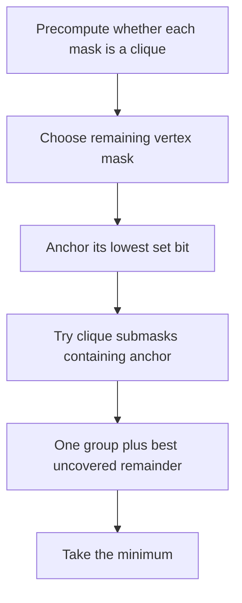

# Close Group

- Source: AtCoder
- USACO Guide ID: `ac-CloseGroup`
- Difficulty at selection: Easy (checked in [Guide source commit ecd27b6](https://github.com/cpinitiative/usaco-guide/blob/ecd27b6eff69112891eabf0c968d3ad0b2a7f745/content/4_Gold/DP_Bitmasks.problems.json))
- Original problem: [AtCoder ABC187 F — Close Group](https://atcoder.jp/contests/abc187/tasks/abc187_f)
- Tags: Bitmask DP, Clique Partition, Graphs
- Solution: [C++](../../solutions/ac-CloseGroup.cpp)

## Problem Summary

Delete any selection of edges from a small undirected graph so that every final connected component has an edge between every pair of its vertices. Minimize the number of resulting components.

This summary is paraphrased for study. Refer to the official problem for the full statement and constraints.

## Visualization Description

Color each candidate vertex subset green if it already forms a clique. Then cover all vertices with the fewest disjoint green subsets. For a current mask, pin its lowest-numbered vertex and try only clique subsets containing that anchor; this avoids considering the same partition in many orders.

## Approach

Deleting edges cannot create a missing edge, so each final component must already be a clique in the original graph. Precompute `is_clique[mask]` by removing one vertex and checking whether it connects to the rest of a known clique. Then let `dp[mask]` be the minimum number of cliques partitioning `mask`. If `mask` is a clique, the answer is one. Otherwise, enumerate clique submasks containing one fixed anchor vertex and minimize `1 + dp[mask without group]`.

## Correctness

A valid final component must contain every possible internal edge, so its vertices form an original-graph clique. Conversely, any partition into original cliques is achievable by deleting all edges between different groups. Therefore the graph task equals minimum clique partition. In every partition of `mask`, exactly one group contains the fixed anchor. The recurrence tries every possible clique for that group and combines it with an optimal partition of the remaining vertices. By induction on the number of set bits, `dp[mask]` is optimal, including the full graph.

## Complexity

- Time: `O(3^N)` in the worst case
- Space: `O(2^N)`

## Verification

The official samples include sparse and complete extremes. The independent verifier uses a separate backtracking partition oracle on small random graphs, plus empty, complete, path, cycle, and disconnected-clique cases. A maximum-size empty graph checks the full bitmask range.
