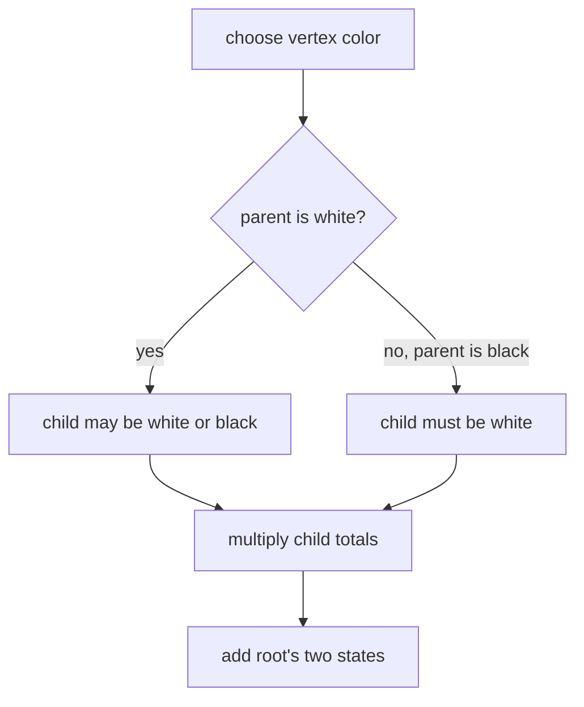

# Independent Set

- Source: AtCoder Educational DP Contest
- USACO Guide ID: `ac-IndependentSet`
- Difficulty at selection: Easy (checked in [Guide source commit ed367e8](https://github.com/cpinitiative/usaco-guide/blob/ed367e8953e137e603d09a36fd7040dcf2e30667/content/4_Gold/DP_Trees.problems.json))
- Original problem: [AtCoder Independent Set](https://atcoder.jp/contests/dp/tasks/dp_p)
- Tags: Tree DP, Counting
- Solution: [C++](../../solutions/ac-IndependentSet.cpp)

## Problem Summary

Color every vertex of a tree either white or black, never making both endpoints of an edge black. Count the valid colorings modulo `1,000,000,007`.

This is a paraphrased study summary. Refer to the official page for the complete statement and constraints.

## Visualization Description

Root the tree and draw two bubbles at each vertex: a white bubble and a black bubble. Arrows from a white parent reach both child bubbles, while arrows from a black parent reach only the child's white bubble. Products combine separate branches.

## Approach

Let `ways[v][0]` count valid subtree colorings when `v` is white and `ways[v][1]` when it is black. For every child, the white state multiplies by the sum of both child states. The black state multiplies only by the child's white state. Process a reverse iterative traversal and add the root's states modulo the required modulus.

## Correctness

With `v` white, no edge from `v` forbids a child color, so each child independently contributes either state. With `v` black, every child must be white, exactly enforcing the only prohibited adjacency. Multiplication counts all independent combinations across child subtrees once. Induction over subtree height proves both DP states count precisely the legal colorings, and summing the two root states counts every full-tree coloring.

## Complexity

- Time: `O(N)`
- Space: `O(N)`

## Verification

The smoke test uses an official sample. The independent verifier tries all `2^N` colorings on small random trees and compares the legal count. It also checks one vertex, paths, stars, and a maximum-length chain.
