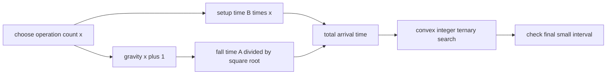

# Freefall

- Source: AtCoder
- USACO Guide ID: `ac-freefall`
- Difficulty at selection: Easy (checked in [Guide source commit 81339ee](https://github.com/cpinitiative/usaco-guide/blob/81339eea4b5e43a0a1e26365f8dc8dfaa60f7705/content/4_Gold/Ternary_Search.problems.json))
- Original problem: [AtCoder ABC279 D](https://atcoder.jp/contests/abc279/tasks/abc279_d)
- Tags: Convex Functions, Integer Ternary Search, Floating Point
- Solution: [C++](../../solutions/ac-freefall.cpp)

## Problem Summary

A fall initially takes `A` time units. Before starting, each power-up spends `B` time units and increases gravity by one, changing the fall time to `A / sqrt(g)`. Choose a nonnegative integer number of power-ups that minimizes the arrival time.

This is a paraphrased study summary. Refer to the official page for the complete statement and constraints.

## Visualization Description

Plot the number of power-ups on the horizontal axis. The setup cost is a rising straight line, while the falling time is a decreasing curve that flattens out. Their sum first falls and then rises, forming one convex valley. Two probe points split the remaining integer interval into thirds; comparing their arrival times tells us which outer third cannot contain the bottom.

## Approach

Define `f(x) = B*x + A/sqrt(x+1)` for integer `x >= 0`. Doing nothing costs `A`, while `x` operations alone cost `B*x`, so an optimum must lie in `0 <= x <= floor(A/B)`.

The first term grows linearly. The second decreases with diminishing improvement, making their sum convex. Ternary-search this finite integer interval until only a few values remain, then evaluate every remaining integer and print the smallest time with high precision.

## Correctness

Any `x > floor(A/B)` spends more than `A` before the fall even begins, while `x=0` finishes in exactly `A`; such an `x` cannot be optimal. The search interval therefore contains a global optimum.

The derivative of the continuous extension increases monotonically, so `f` is convex and has one valley. When the left ternary probe is no larger than the right probe, no point strictly to the right of the right probe can improve the minimum; the symmetric statement holds for the other comparison. Each iteration retains an optimum. Exhaustively checking the final interval therefore returns the best integer operation count and the earliest possible arrival time.

## Complexity

- Time: `O(log(A/B))`
- Space: `O(1)`

## Verification

The smoke test covers the official no-operation optimum. The independent verifier compares random small inputs with exhaustive enumeration, checks all official samples numerically, and stresses both `A` and `B` at their maximum values.
