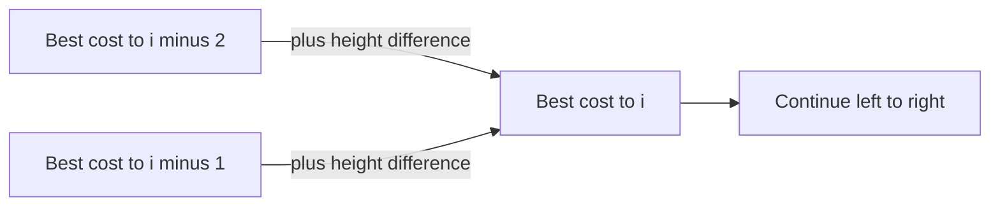

# Frog 1

- Source: AtCoder
- USACO Guide ID: `ac-frog1`
- Difficulty at selection: Easy
- Original problem: [AtCoder Educational DP Contest — Frog 1](https://atcoder.jp/contests/dp/tasks/dp_a)
- Tags: Dynamic Programming
- Solution: [`../../solutions/ac-frog1.cpp`](../../solutions/ac-frog1.cpp)

## Problem Summary

A frog starts on the first of `N` stones. From each stone it may move forward by one or two positions, paying the absolute height difference between its takeoff and landing stones. Find the least possible total cost to reach the final stone.

This summary is paraphrased for study. Use the official link for the full statement and constraints.

## Visualization Description

Draw the stones from left to right and place a cost label on every arrow of length one or two. Reaching stone `i` can only use the arrow from `i-1` or the arrow from `i-2`, so the cheapest route to `i` is the smaller of those two completed routes.

## Approach

Let `dp[i]` be the minimum cost required to finish on stone `i`. Set `dp[0] = 0`. For each later stone, try the final jump from `i-1`; when `i >= 2`, also try the final jump from `i-2`. Add the appropriate absolute height difference and keep the smaller result.

Processing from left to right guarantees that both predecessor values are final before they are used.

## Correctness

We prove by induction that `dp[i]` is the minimum cost of reaching stone `i`. The base case `dp[0] = 0` is correct because the frog starts there. For `i > 0`, every legal route to `i` must make its last jump from `i-1` or, when it exists, `i-2`. By the induction hypothesis, the stored cost to each predecessor is minimal. Adding the fixed cost of its final jump therefore gives the cheapest route using that predecessor. Taking the minimum over every legal predecessor considers all possible final jumps, so `dp[i]` is optimal. Thus `dp[N-1]` is the requested answer.

## Complexity

- Time: `O(N)`
- Space: `O(N)`

## Verification

The smoke test covers the first official example. The independent verifier enumerates every legal sequence of one-step and two-step jumps for many small random height arrays and compares the cheapest route with the C++ output.
