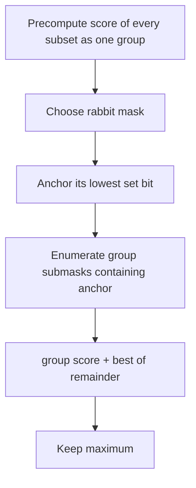

# Grouping

- Source: AtCoder
- USACO Guide ID: `ac-grouping`
- Difficulty at selection: Easy (checked in [Guide source commit a023ae1](https://github.com/cpinitiative/usaco-guide/blob/a023ae1bbe10171de93301d4d5891bc89ad2bc14/content/4_Gold/DP_Bitmasks.problems.json))
- Original problem: [AtCoder Educational DP Contest U — Grouping](https://atcoder.jp/contests/dp/tasks/dp_u?lang=en)
- Tags: Bitmask DP, Set Partition, Submask Enumeration
- Solution: [C++](../../solutions/ac-grouping.cpp)

## Problem Summary

Partition up to sixteen rabbits into any number of nonempty groups. Each pair placed in the same group contributes its given compatibility score, which may be positive or negative. Maximize the sum over all within-group pairs.

This summary is paraphrased for study. Refer to the official problem for the full statement and constraints.

## Visualization Description

Treat each possible group as a bitmask card carrying the sum of all pair scores inside it. To partition a larger mask, pin its lowest set bit. Try every group card that contains that anchor, then attach the best partition card for the uncovered rabbits. The anchor makes each unordered partition appear in a single order.

## Approach

First compute `group_score[mask]`: remove one rabbit from `mask`, reuse the smaller score, and add that rabbit's affinity with everyone remaining. Then define `best[mask]` as the maximum score obtainable by partitioning exactly the rabbits in `mask`. For each nonempty mask, enumerate candidate first groups that contain one fixed anchor rabbit. Combine `group_score[group]` with `best[mask ^ group]` and take the maximum.

Using 64-bit integers is required because a legal answer can exceed 32-bit range. Starting DP values at negative infinity also matters: pair weights may be negative, even though singleton groups ensure the final answer is at least zero.

## Correctness

`group_score[group]` includes each unordered pair inside the group exactly once. Now consider any partition of `mask`. Exactly one of its groups contains the chosen anchor, and the recurrence enumerates that precise group; the remaining groups form a partition of `mask ^ group`. Conversely, every recurrence choice joins one valid group with a disjoint partition of the remainder, producing a valid partition of `mask`. Induction on the number of set bits shows `best[mask]` is the optimum for every mask, including the full set.

## Complexity

- Time: `O(N * 2^N + 3^N)`
- Space: `O(2^N + N^2)`

## Verification

The smoke test covers a profitable pair that must exclude a strongly negative edge. The independent oracle recursively assigns small random rabbits to canonical unlabeled groups and compares the exact optimum. It includes all-negative, all-positive, mixed, singleton, and maximum-size cases, including a result above 32-bit range.
