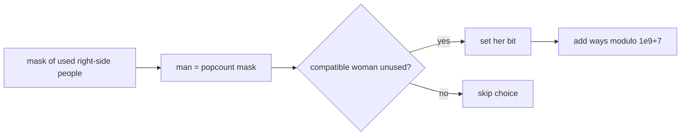

# Matching

- Source: AtCoder
- USACO Guide ID: `ac-matching`
- Difficulty at selection: Easy (checked in [Guide source commit a023ae1](https://github.com/cpinitiative/usaco-guide/blob/a023ae1bbe10171de93301d4d5891bc89ad2bc14/content/4_Gold/DP_Bitmasks.problems.json))
- Original problem: [AtCoder Educational DP Contest O — Matching](https://atcoder.jp/contests/dp/tasks/dp_o?lang=en)
- Tags: Bitmask DP, Perfect Matching, Counting
- Solution: [C++](../../solutions/ac-matching.cpp)

## Problem Summary

Two equally sized groups must be paired one-to-one. A binary matrix says which cross-group pairs are allowed. Count every complete pairing that uses only allowed pairs, modulo `1,000,000,007`.

This summary is paraphrased for study. Refer to the official problem for the full statement and constraints.

## Visualization Description

Imagine the left group fixed in order. A bitmask records which people on the right have already been taken. If a mask has three set bits, then the first three people on the left are already paired, so the next row is determined without storing it separately. Each legal unset bit creates one edge to a larger mask.

## Approach

Let `dp[mask]` be the number of ways to pair the first `popcount(mask)` men with exactly the women selected by `mask`. Start with `dp[0]=1`. For every state, identify the next man using the bit count. For each compatible woman whose bit is not set, add `dp[mask]` to the state with her bit set. The full mask is the answer.

The state intentionally stores only the used women. The number of paired men is forced by the mask size, which removes a redundant dimension.

## Correctness

The base state represents the single empty matching. Assume `dp[mask]` correctly counts all valid partial matchings of the first `|mask|` men. Every extension must pair the next man with exactly one compatible unused woman; the transition tries each such woman once. Different woman choices produce different next masks or different underlying partial matchings, so no complete matching is lost or double-counted. By induction over mask size, the full-mask value counts exactly all valid perfect matchings.

## Complexity

- Time: `O(N * 2^N)`
- Space: `O(2^N)`

## Verification

The smoke test uses the first official sample. The independent verifier enumerates all permutations for small random compatibility matrices and compares their exact valid-matching counts. It also checks impossible, identity-only, and all-compatible cases, plus a maximum-size identity matrix to exercise all `2^21` states.
