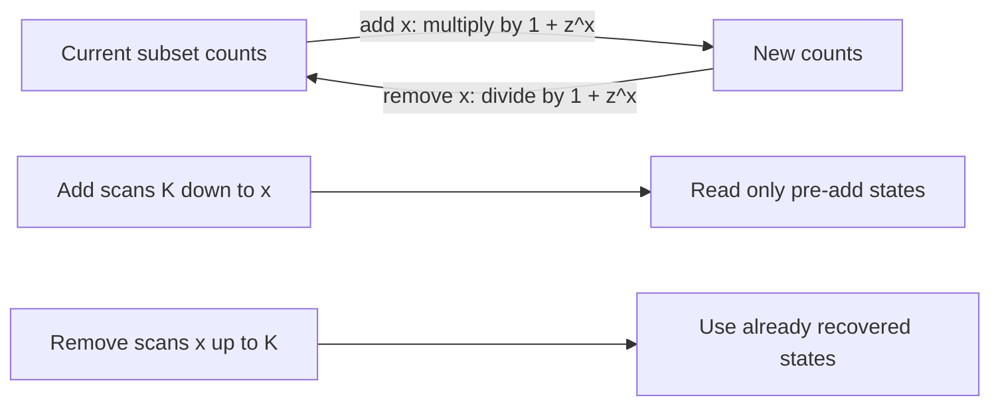

# Subset Sum Queries

- Source: AtCoder
- USACO Guide ID: `ac-subsetSumQueries`
- Difficulty at selection: Easy
- Original problem: [AtCoder ABC321 F — # (subset sum = K) with Add and Erase](https://atcoder.jp/contests/abc321/tasks/abc321_f?lang=en)
- Tags: Dynamic Programming, Knapsack, Generating Functions
- Solution: [`../../solutions/ac-subsetSumQueries.cpp`](../../solutions/ac-subsetSumQueries.cpp)

## Problem Summary

A box starts empty. Each query adds one numbered ball or removes one existing ball. After every query, report how many subsets of the current, distinguishable balls have values summing to a fixed target `K`, modulo `998244353`.

This summary is paraphrased for study. Use the official link for the full statement and constraints.

## Visualization Description

Picture one column for every sum from `0` through `K`. Adding a ball of value `x` sends each old count at column `s-x` into column `s`. The arrows are followed from right to left so this ball cannot be chosen twice. Removing the ball reverses the same transformation: from left to right, subtract the already recovered count at `s-x`.

## Approach

Maintain `ways[s]`, the number of subsets of the balls currently in the box whose sum is `s`. Initially only the empty subset exists, so `ways[0] = 1`.

- To add `x`, update `ways[s] += ways[s-x]` for `s` from `K` down to `x`.
- To remove `x`, recover the state without that ball using `new[s] = old[s] - new[s-x]`, scanning `s` from `x` up to `K`.
- Values larger than `K` can be ignored because all values are positive and cannot participate in a subset totaling `K`.

## Correctness

For an addition, every subset after the query either excludes the new ball, already counted by the old `ways[s]`, or includes it, in one-to-one correspondence with an old subset totaling `s-x`. The descending scan ensures these two classes use the ball zero or one time.

For a removal, let `old[s]` include the chosen ball and `new[s]` exclude it. The addition identity was `old[s] = new[s] + new[s-x]`. Rearranging gives `new[s] = old[s] - new[s-x]`. An ascending scan has already recovered `new[s-x]`, so every entry is restored exactly. Thus `ways[K]` is correct after every query.

## Complexity

- Time: `O(QK)`
- Space: `O(K)`

## Verification

The smoke test uses the official sample. The independent verifier generates valid random add/remove sequences with small targets, enumerates every subset of the current distinguishable balls after every operation, and compares every reported count. It also exercises duplicate values, values above `K`, and removal after several additions.
