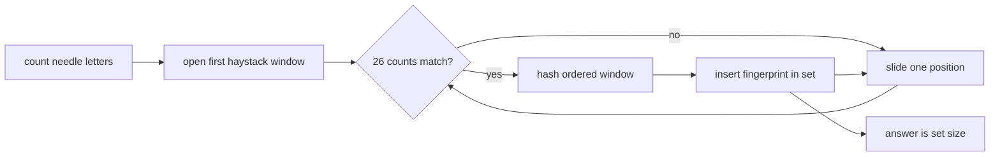

# Searching For Strings

- Source: Canadian Computing Competition
- USACO Guide ID: `ccc-SearchingForStrings`
- Difficulty at selection: Easy (checked in [Guide source commit ff59fe9](https://github.com/cpinitiative/usaco-guide/blob/ff59fe9483c6e72b738d607950bf6634455bd8db/content/4_Gold/Hashing.problems.json))
- Original problem: [CCC 2020 S3 on DMOJ](https://dmoj.ca/problem/ccc20s3)
- Tags: Sliding Window, Frequency Counting, Rolling Hash
- Solution: [C++](../../solutions/ccc-SearchingForStrings.cpp)

## Problem Summary

Given a short “needle” string and a “haystack” string, count how many different reorderings of the needle occur as contiguous substrings of the haystack. Repeated appearances of the same ordered substring count only once.

This is a paraphrased study summary. Refer to the official page for the complete statement and constraints.

## Visualization Description

Place a frame whose width equals the needle length over the haystack. Twenty-six counters under the frame show the current letter multiset. A window becomes a candidate when those counters match the needle's counters. Each candidate then receives an order-sensitive double-hash fingerprint, and duplicate fingerprints fall into the same set bucket.

## Approach

Only a substring of length `|N|` can be a permutation of the needle. Maintain its 26 letter counts while sliding through the haystack; removing the departing character and adding the arriving character takes constant time.

Matching frequency tables prove that a window is a permutation, but do not distinguish its order. Precompute two polynomial prefix hashes for the haystack. Each matching window then has a constant-time ordered fingerprint. Store the packed pair of residues in a hash set, so several occurrences of the same permutation contribute one answer.

## Correctness

Every inspected window has length `|N|`. Its frequency table equals the needle's table exactly when it contains every letter with the required multiplicity, which is exactly the definition of a permutation. Therefore only valid permutations enter the set, and every valid occurrence is considered.

Equal ordered window strings have equal hashes and collapse to one set entry. With two large prime moduli, different strings collide only with negligible probability. Thus the set size is the number of distinct matching permutations with the standard rolling-hash guarantee used by the Guide.

## Complexity

- Time: `O(|N| + 26|H|)`, which is `O(|N| + |H|)` for the fixed lowercase alphabet
- Space: `O(|H|)` for prefix hashes and distinct fingerprints

## Verification

The smoke test is the official sample. The independent verifier compares hundreds of random small strings against a brute-force set of literal substrings and includes a 200,000-character stress case.
