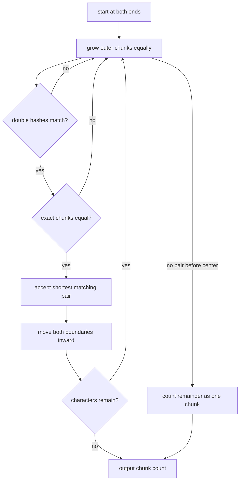

# Palindromic Partitions

- Source: CEOI 2017
- USACO Guide ID: `ceoi-17-PalindromicPartitions`
- Difficulty at selection: Easy (checked in [Guide source commit ff59fe9](https://github.com/cpinitiative/usaco-guide/blob/ff59fe9483c6e72b738d607950bf6634455bd8db/content/4_Gold/Hashing.problems.json))
- Original problem: [QOJ 793](https://qoj.ac/problem/793/)
- Tags: Greedy, Two Pointers, Rolling Hash
- Solution: [C++](../../solutions/ceoi-17-PalindromicPartitions.cpp)

## Problem Summary

Split each word into the greatest possible number of nonempty chunks so that the sequence of whole chunk strings reads the same from left to right and right to left. Individual chunks do not need to be character palindromes.

This is a paraphrased study summary. Refer to the official page for the complete statement and constraints.

## Visualization Description

Write the word on one strip with pointers moving inward from both ends. Grow a candidate chunk from the left and another from the right. Two pairs of rolling hash values behave like rapidly updated labels. At the first equal pair, draw matching brackets around both chunks, add two, and restart inside. Any final unmatched middle becomes one center chunk.

## Approach

For the current remaining interval, grow same-length prefix and suffix candidates. Maintain their forward polynomial hashes incrementally from opposite ends. Accept the shortest equal outer pair, add two chunks, and repeat inside. If no equal pair exists before the candidates would overlap, the entire remainder is the single center chunk.

The well-known longest chunked-palindrome greedy rule is to cut at the earliest matching prefix and suffix. Delaying an available match cannot create more outer pairs than taking it now; the remaining interval can be optimized independently. Double 64-bit fingerprints make comparison fast, and an exact byte comparison confirms every accepted cut.

## Correctness

Any palindromic chunk sequence with more than one chunk must begin and end with equal strings. The algorithm finds the shortest such equal outer strings. The greedy exchange property for chunked palindromes says an optimal decomposition can use this earliest matching border without reducing its chunk count; doing so immediately earns two chunks and leaves the same problem on the interior. Repeating this argument proves every accepted pair belongs to some optimum.

When no equal outer pair exists, no palindromic decomposition of the remainder can have two or more chunks, so counting it as one center chunk is optimal. Exact byte confirmation prevents hash collisions from changing a decision.

## Complexity

- Expected time: `O(N)` per test case
- Space: `O(1)` beyond the input string

## Verification

The smoke test covers all four official examples. The independent verifier enumerates every partition of thousands of short random words, filters those whose chunk lists are palindromes, and compares the maximum with the greedy solution. A one-million-character stress case checks the stated bound.
