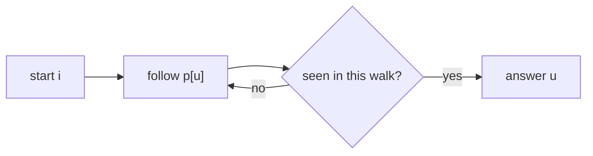

# Div 2 B - Badge

- Source: CF
- USACO Guide ID: `cf-1020B`
- Original problem: [https://codeforces.com/contest/1020/problem/B](https://codeforces.com/contest/1020/problem/B)
- Tags: Functional Graph
- Solution: [`../../solutions/cf-1020B.cpp`](../../solutions/cf-1020B.cpp)

## Problem Summary

For every starting vertex in a functional graph, output the first vertex visited twice.

This is a paraphrase for study notes. Use the original problem link for the official statement, constraints, and judge-specific details.

## Visualization Description

Following pointers creates a tail leading into a cycle; the first repeated node is where the walk enters the already-seen part.

## Approach

Each node has exactly one outgoing edge. Starting from i, follow pointers while marking vertices seen during this walk. The first repeated vertex is the answer for i. The constraints are small enough for O(n^2) simulation.

## Correctness Notes

The solution keeps the invariant described in the approach and updates only the state that can affect future answers. For query-style problems, preprocessing stores exactly the aggregate needed to answer each query. For graph and tree problems, each selected data structure operation mirrors one allowed change in the represented structure.

## Complexity

See the comments and structure of the C++ solution for the exact loop/data-structure cost. The intended complexity is efficient for the official constraints of the linked problem.

## Verification

Checked self-loops, pure cycles, and tails into cycles.
