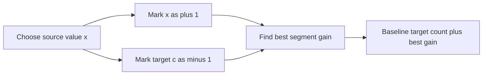

# Increasing Frequency

- Source: Codeforces
- USACO Guide ID: `cf-1082E`
- Difficulty at selection: Easy
- Original problem: [Codeforces 1082E](https://codeforces.com/problemset/problem/1082/E)
- Tags: Dynamic Programming, Kadane's Algorithm
- Solution: [`../../solutions/cf-1082E.cpp`](../../solutions/cf-1082E.cpp)

## Problem Summary

Given an array and a target value `c`, choose one nonempty contiguous segment and add one integer `k` to every value in that segment. Maximize how many array entries equal `c` afterward.

This study summary is paraphrased. The official statement and constraints are available at the linked judge page.

## Visualization Description

Fix a value `x` that we want to convert into `c`. Along the array, mark every `x` with `+1`, every existing `c` with `-1`, and every other value with `0`. The best segment for this `x` is exactly the maximum-sum subarray of those marks. Existing targets outside the segment form a guaranteed baseline.

## Approach

Suppose a useful nonzero operation converts some original value `x` into `c`, so `k = c-x`. Within its segment, each `x` is gained and each old `c` is lost; unrelated values do not affect the count. The net improvement is therefore `count(x) - count(c)` in that segment.

Maintain a Kadane-style best segment ending at the latest occurrence of each value `x`. A global counter records how many targets have appeared. When another `x` arrives, subtract the targets seen since the previous `x`, add one for this occurrence, and either extend the old segment or restart with gain one. This lazy accounting processes only the value that appears at the current position, keeping the whole algorithm linear.

## Correctness

Any operation that increases the answer must choose `k = c-x` for some non-target value `x`; then its change in target count is exactly the number of `x` values inside the segment minus the number of existing `c` values there. For fixed `x`, an optimal segment can start and end at occurrences of `x`, because trimming zero or negative boundary contributions never hurts.

When an occurrence of `x` is processed, `ending_gain[x]` is the best score of any segment ending at that occurrence. Extending the prior best adds one for the new `x` and subtracts precisely the targets since the prior occurrence; restarting gives score one. Their maximum considers every possible optimal start. Therefore `best_gain` becomes the maximum improvement over every segment and every source value. Adding the unchanged baseline count of `c` yields the global optimum; choosing `k=0` is also covered because the gain may remain zero.

## Complexity

- Time: `O(N)`
- Space: `O(V)`, where `V` is the largest array value or target

## Verification

The smoke test covers both official examples. The independent randomized verifier exhaustively tries every segment and every meaningful shift on small arrays, then compares the maximum target count with the optimized C++ result.
