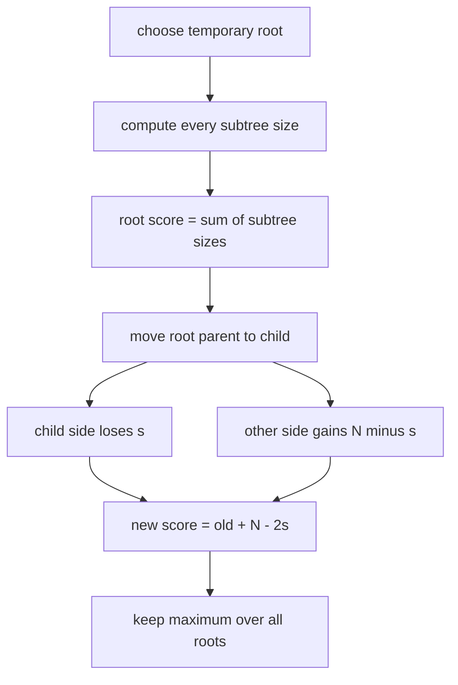

# Tree Painting

- Source: Codeforces
- USACO Guide ID: `cf-1187E`
- Difficulty at selection: Easy (checked in [Guide source commit 74a8cf6](https://github.com/cpinitiative/usaco-guide/blob/74a8cf603185c1cb84020b7a483a0e1bacef186e/content/4_Gold/All_Roots.problems.json))
- Original problem: [Codeforces Tree Painting](https://codeforces.com/contest/1187/problem/E)
- Tags: Tree DP, Rerooting
- Solution: [C++](../../solutions/cf-1187E.cpp)

## Problem Summary

Begin with a white tree. Paint one starting vertex, then repeatedly paint a white vertex touching the connected black region. Each move scores the size of that vertex's current all-white component. Find the greatest possible total score.

This is a paraphrased study summary. Refer to the official page for the complete statement and constraints.

## Visualization Description

Choose a starting root and hang the tree below it. When a vertex is ready to be painted, its parent is black but none of its descendants could have been reached yet, so its white component is exactly its subtree. Now slide the root across one edge: the moved-into subtree gets one level closer, while every other vertex gets one level farther.

## Approach

Root the tree temporarily at vertex `1`. Compute every subtree size in a reverse iterative traversal. For this root, the score is the sum of all subtree sizes. Then visit vertices from parent to child. When moving the root across an edge into a child whose old subtree contains `s` vertices, update the score with `new = old + N - 2s`. Track the maximum score among all possible roots.

## Correctness

After choosing a starting vertex, orient every edge away from it. A non-root vertex cannot be painted before its parent, and none of its descendants can be painted before it, so when it is selected its white component is its complete rooted subtree. Thus a root's attainable score is the sum of its subtree sizes. When rerooting from a parent to a child with old subtree size `s`, the `s` vertices on the child's side each become one level closer and reduce the subtree-size sum by one; the remaining `N-s` vertices become one level farther and increase it by one. The formula `old - s + (N-s)` is therefore exact. Applying it along every tree edge computes every starting-root score, and the recorded maximum is optimal.

## Complexity

- Time: `O(N)`
- Space: `O(N)`

## Verification

The smoke test uses an official sample. For many small random trees, an independent subset-state oracle enumerates every legal next painted vertex and directly measures its white connected component. A 200,000-vertex path checks 64-bit totals and nonrecursive traversal safety.
