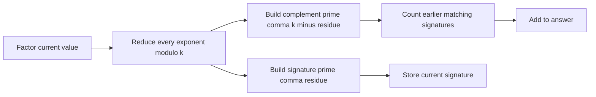

# Power Products

- Source: Codeforces
- USACO Guide ID: `cf-1225D`
- Difficulty at selection: Easy
- Original problem: [https://codeforces.com/contest/1225/problem/D](https://codeforces.com/contest/1225/problem/D)
- Tags: Number Theory, Prime Factorization, Maps
- Solution: [`../../solutions/cf-1225D.cpp`](../../solutions/cf-1225D.cpp)

## Problem Summary

Given up to `100,000` positive integers and an exponent `k`, count index pairs whose product is a perfect `k`-th power.

This is a paraphrase for study notes. Use the original link for the official statement and constraints.

## Visualization Description

Draw each number as columns of prime-factor tokens. Fold every column height modulo `k`; complete groups of `k` disappear because they already form a perfect `k`-th power. For every leftover column of height `r`, a matching number needs a column of height `k-r`. Two numbers pair exactly when all these complementary columns line up.

## Approach

Precompute the smallest prime factor of every possible input value. Factor each array value, reduce every prime exponent modulo `k`, and omit zero residues. The resulting ordered list of `(prime, residue)` pairs is its signature. Its complementary signature replaces every residue `r` with `k-r`.

Process the array from left to right. A map records how many earlier values have each signature. Before inserting the current signature, add the frequency of its complement to the answer.

## Correctness

In a perfect `k`-th power, every prime exponent is divisible by `k`. For two values, the exponent of each prime in their product is the sum of their two exponents. Reducing modulo `k` shows that the sum is zero exactly when one residue is the complement of the other. Therefore two values form a valid pair exactly when one signature equals the other's complementary signature. At each position, the algorithm counts all and only earlier matching values, so every valid index pair is counted once and no invalid pair is counted.

## Complexity

- Time: `O(M log log M + n log M log n)`, where `M` is the largest input value
- Extra space: `O(M + n log M)`

## Verification

The smoke test uses the official sample. A deterministic randomized verifier builds hundreds of small arrays, tests each pair by direct perfect-power search, and compares that brute-force count with the C++ answer.
