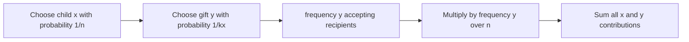

# Santa's Bot

- Source: Codeforces
- USACO Guide ID: `cf-1279D`
- Difficulty at selection: Easy
- Original problem: [https://codeforces.com/contest/1279/problem/D](https://codeforces.com/contest/1279/problem/D)
- Tags: Probability, Modular Arithmetic, Counting
- Solution: [`../../solutions/cf-1279D.cpp`](../../solutions/cf-1279D.cpp)

## Problem Summary

Each child provides a distinct list of acceptable gifts. A bot independently chooses a first child uniformly, chooses one gift uniformly from that child's list, and chooses a recipient child uniformly. Find the probability that the recipient also accepts the chosen gift, represented modulo `998,244,353`.

This is a paraphrase for study notes. Use the original link for the official statement and constraints.

## Visualization Description

Draw a three-stage probability tree: first child, one branch for each gift on that child's list, then every possible recipient. Instead of visiting every leaf, label each gift with how many recipient lists contain it. That frequency counts all successful third-stage branches at once.

## Approach

First count `frequency[y]`, the number of children whose list contains gift `y`. For a fixed first child `x` and one gift `y` on that list, the probability of this path being successful is `(1/n) * (1/k_x) * (frequency[y]/n)`.

Summing by child gives

`answer = (1/n^2) * sum_x ((1/k_x) * sum_(y in list x) frequency[y])`.

Store every list while building the frequency array, then evaluate this formula in one more pass. Division modulo the prime is multiplication by a modular inverse found with Fermat's little theorem.

## Correctness

For a fixed pair `(x,y)`, the algorithm uses `frequency[y]` to count exactly the recipient children who make that bot decision valid. Multiplying by the inverse of `k_x` assigns the correct probability to choosing gift `y` from child `x`; multiplying twice by the inverse of `n` assigns the independent probabilities of choosing `x` and the recipient. Every possible decision triple has exactly one first child, gift, and recipient, so summing these disjoint successful probabilities gives precisely the requested probability.

## Complexity

Let `S` be the total number of listed gifts.

- Time: `O(S + n log MOD)` with one inverse per child
- Extra space: `O(S + 10^6)`

## Verification

The smoke test uses both official examples. Deterministic random tests enumerate every `(first child, gift, recipient)` triple as an exact rational number and compare its modular representation with the program, including one child, disjoint lists, identical lists, and gifts requested at very different frequencies.
