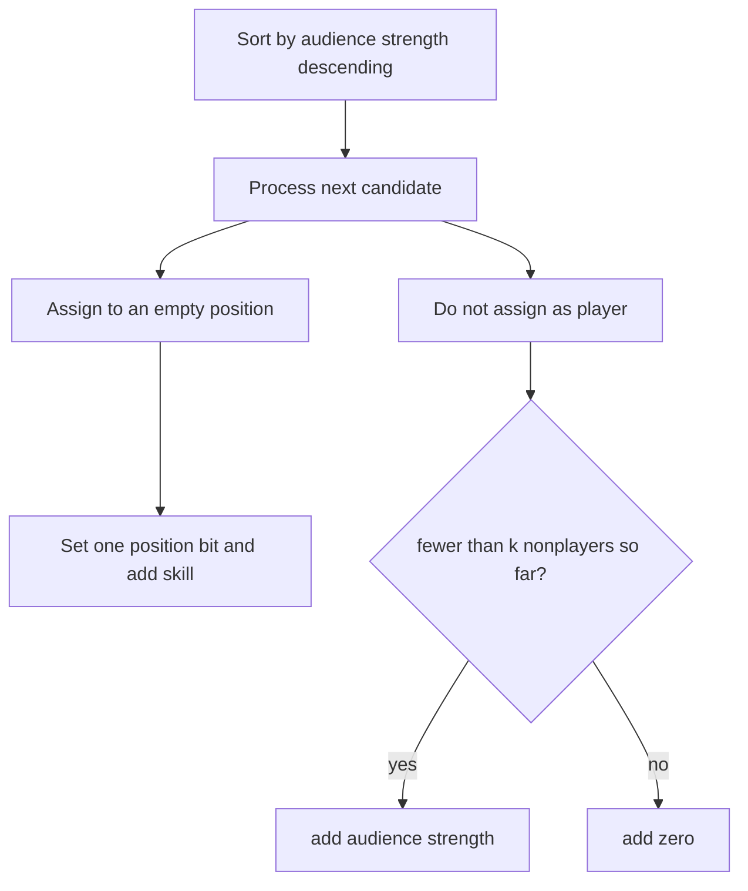

# Team Building

- Source: Codeforces
- USACO Guide ID: `cf-1316E`
- Difficulty at selection: Easy (checked in [Guide source commit a023ae1](https://github.com/cpinitiative/usaco-guide/blob/a023ae1bbe10171de93301d4d5891bc89ad2bc14/content/4_Gold/DP_Bitmasks.problems.json))
- Original problem: [Codeforces 1316E — Team Building](https://codeforces.com/contest/1316/problem/E)
- Tags: Bitmask DP, Sorting, Greedy
- Solution: [C++](../../solutions/cf-1316E.cpp)

## Problem Summary

Choose one distinct player for each of a small number of positions and choose a fixed number of other people as audience members. A person has one audience value and a separate value for every position. Maximize the combined strength while using nobody twice.

This summary is paraphrased for study. Refer to the official problem for the full statement and constraints.

## Visualization Description

Sort candidate cards from highest to lowest audience value. A small bitmask marks filled playing positions. When a card arrives, either place it in an empty position or leave it out of the player mask. Among people left out, the first `k` cards automatically form the strongest possible audience.

## Approach

Sort people by decreasing audience score. Let `dp[mask]` be the best value after a prefix of candidates, with `mask` indicating occupied positions. From each state, the current person can fill any unset position and add that position score. Otherwise the person remains a nonplayer. If `processed - popcount(mask) < k`, fewer than `k` earlier nonplayers exist, so this person's audience score is added; after that quota is full, the person contributes zero.

Rolling arrays separate one candidate's choices and reduce memory to `O(2^P)`.

## Correctness

Fix any set of people chosen as players. Because candidates are sorted by audience score, the best allowed audience is exactly the first `k` nonplayers in that order. The nonplayer transition adds precisely those first `k` values. Player transitions consider every candidate for every still-empty position, and the mask prevents one person from filling multiple positions. Thus every feasible player assignment is represented with its optimal audience, and every represented state is feasible. Taking the full-position mask after all candidates therefore gives the global maximum.

## Complexity

- Time: `O(N log N + N * P * 2^P)`
- Space: `O(N * P + 2^P)`

## Verification

The smoke test uses the first official sample. The independent verifier enumerates every injective assignment of small random candidates to positions, then chooses the best remaining audience directly. It checks tempting audience-versus-player conflicts, tied audience scores, and a maximum-size `N=100,000`, `P=7` case.
