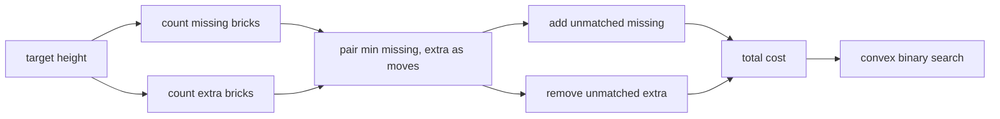

# Restorer Distance

- Source: Codeforces
- USACO Guide ID: `cf-1355E`
- Difficulty at selection: Easy (checked in [Guide source commit 7bf6d95](https://github.com/cpinitiative/usaco-guide/blob/7bf6d95ba5cbca9c37bc5cb96514a80b134bd4a5/content/4_Gold/Ternary_Search.problems.json))
- Original problem: [Codeforces 1355E](https://codeforces.com/contest/1355/problem/E)
- Tags: Convex Functions, Binary Search, Greedy Pairing
- Solution: [C++](../../solutions/cf-1355E.cpp)

## Problem Summary

Make all pillar heights equal. A brick may be added, removed, or transferred from one pillar to another, with a given price for each operation. Choose the final height that minimizes the total price.

This is a paraphrased study summary. Refer to the official page for the complete statement and constraints.

## Visualization Description

For a candidate height, color missing bricks blue and extra bricks orange. Pair one blue with one orange to form a transfer while that is cheaper than a remove-plus-add. Unpaired blue bricks are added and unpaired orange bricks are removed. Plotting this cost for successive target heights forms a convex valley that neighboring-value binary search can locate.

## Approach

First replace the move price by `min(M, A + R)`, because a costly move can always be simulated by one removal and one addition.

At target `x`, count the total deficit and surplus. Transfer `min(deficit, surplus)` bricks, then add or remove the leftovers. This gives the cheapest cost for that target. The result is convex as `x` changes, so compare `cost(mid)` with `cost(mid + 1)` and binary-search heights from zero to the current maximum.

## Correctness

After capping the move price, pairing any surplus brick with any missing brick never costs more than handling the two separately. Therefore an optimal plan transfers exactly the smaller of total surplus and total deficit, then uses the only possible operation on each leftover brick. The evaluator is optimal for a fixed target.

Raising the target converts removals into moves and then additions with nondecreasing marginal cost, so the evaluated function is convex. The neighboring-value search discards only the side beyond the direction of descent and preserves a global minimum until one height remains. The returned cost is therefore globally minimal.

## Complexity

- Time: `O(N log H)`, where `H` is the largest initial height
- Space: `O(N)`

## Verification

The smoke test uses all five official examples in one run. The independent verifier exhaustively evaluates every target for random small instances and checks zero-price operations, an overpriced move, equal pillars, and large values.
