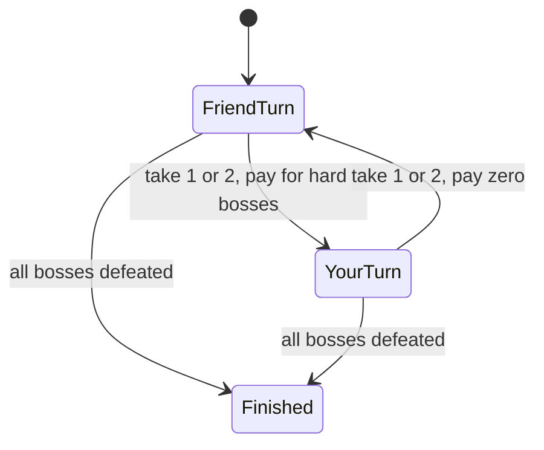

# Mortal Kombat Tower

- Source: Codeforces
- USACO Guide ID: `cf-1418C`
- Difficulty at selection: Easy
- Original problem: [Codeforces 1418C](https://codeforces.com/problemset/problem/1418/C)
- Tags: Dynamic Programming
- Solution: [`../../solutions/cf-1418C.cpp`](../../solutions/cf-1418C.cpp)

## Problem Summary

You and a friend must defeat an ordered row of easy and hard bosses. Sessions alternate, beginning with the friend, and each session must take the next one or two bosses. You can handle any boss freely, while the friend spends one skip point for each hard boss they take. Minimize the friend's total skip points.

This is a paraphrase rather than a copy of the judge statement. See the official page for complete constraints.

## Visualization Description

Picture two layers above each prefix of the boss row: one layer says “friend goes next,” and the other says “you go next.” From either layer, arrows advance by one or two bosses and switch layers. Only arrows leaving the friend layer add the number of hard bosses crossed.

## Approach

Use `dp[i][turn]`, the fewest skip points after defeating exactly `i` bosses, with `turn` identifying who acts next. Start at `dp[0][friend] = 0`. From every reachable state, let the current player take one or two bosses if enough remain, switch the turn, and relax the new state. A friend's transition adds the sum of the `0/1` difficulty markers it consumes; your transition adds zero.

## Correctness

Every path through the DP begins with the friend, alternates players, and advances by one or two bosses, so it represents a legal play schedule. Conversely, every legal schedule has exactly one matching DP path because its session sizes and alternating players determine each transition. The transition cost equals the skip points used during that session: the number of hard bosses for the friend and zero for you. Thus each path cost equals its schedule's total skip points. Standard minimum relaxation retains the cheapest path to every state, so the minimum of the two states after `n` bosses is the minimum cost of any legal schedule.

## Complexity

- Time: `O(N)` per test case
- Space: `O(N)` per test case

## Verification

The smoke test includes all six official examples. The independent verifier recursively enumerates all choices of one or two bosses for both players on small random boss rows and compares its optimum with the C++ program.
