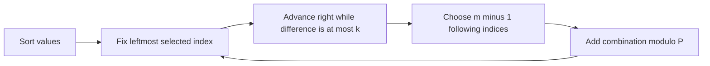

# Close Tuples (Hard Version)

- Source: Codeforces
- USACO Guide ID: `cf-1462E2`
- Difficulty at selection: Easy
- Original problem: [https://codeforces.com/contest/1462/problem/E2](https://codeforces.com/contest/1462/problem/E2)
- Tags: Sorting, Two Pointers, Combinatorics
- Solution: [`../../solutions/cf-1462E2.cpp`](../../solutions/cf-1462E2.cpp)

## Problem Summary

For each test case, count the ways to choose `m` array indices whose selected values have maximum minus minimum at most `k`. Values may repeat, `m` can reach 100, and the total input length is at most 200,000. Return each count modulo `1,000,000,007`.

This is a paraphrase for study notes. Use the original link for the official statement and constraints.

## Visualization Description

Sort the values and place a window with its left edge on one candidate minimum. Extend the right edge through every value no more than `k` above it. Keep the leftmost index, then choose the remaining `m-1` dots anywhere inside the window. Sliding the left edge assigns every tuple to exactly one minimum index—even when several values are equal.

## Approach

Sort the array. For every index `left`, move a shared pointer `right` to the first value greater than `values[left] + k`. If `c = right-left-1` later indices remain inside the allowed range, choosing `m-1` of them creates `C(c,m-1)` tuples whose leftmost selected index is `left`.

Precompute factorials and inverse factorials once through 200,000, allowing each combination to be evaluated in `O(1)`. The right pointer never moves backward, so all windows take linear time after sorting.

## Correctness

For a fixed `left`, every index in `[left+1,right)` differs from `values[left]` by at most `k`, so any `m-1` selected from that range forms a valid tuple with `left`. No index at or after `right` can join a tuple whose minimum index is `left`, because its value is too large. Every valid tuple has one unique leftmost selected index in sorted order; when the algorithm processes that index, all its other indices lie in the corresponding window and are chosen once by the combination. Therefore every valid tuple is counted exactly once and no invalid tuple is counted.

## Complexity

- Per test case: `O(n log n)` time for sorting plus `O(n)` scanning
- Shared preprocessing: `O(200,000 + log P)`
- Extra space: `O(n + 200,000)`

## Verification

The smoke test uses all four official examples. Random small tests compare the optimized answer with direct enumeration of every size-`m` index combination, including duplicate values, `m=1`, windows that are too short, and windows containing the whole array.
