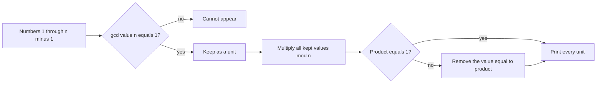

# Product 1 Modulo N

- Source: Codeforces
- USACO Guide ID: `cf-1514C`
- Difficulty at selection: Easy
- Original problem: [https://codeforces.com/problemset/problem/1514/C](https://codeforces.com/problemset/problem/1514/C)
- Tags: Divisibility, Modular Arithmetic, Greedy
- Solution: [`../../solutions/cf-1514C.cpp`](../../solutions/cf-1514C.cpp)

## Problem Summary

Choose the largest possible increasing subsequence from the integers `1` through `n-1` whose product leaves remainder `1` after division by `n`.

This is a paraphrase for study notes. Use the original link for the official statement and constraints.

## Visualization Description

Imagine placing every number below `n` into one of two bins. Values sharing a factor with `n` go into a locked bin because any product containing one can never become `1 mod n`. The coprime values go into a usable bin. Multiply the usable bin modulo `n`; if its residue is not one, remove the card whose value equals that residue.

## Approach

Collect every value coprime with `n` and multiply them modulo `n`. These are the only values that could belong to a valid answer. If their total product is already `1`, print all of them. Otherwise, remove the one value equal to the total product and print the rest.

The running product is itself coprime with `n`, so it is guaranteed to occur in the collected list. Removing it multiplies the total by its modular inverse and leaves residue `1`.

## Correctness

If a selected value is not coprime with `n`, then it and the full product share a prime factor with `n`; the product cannot be congruent to `1`. Therefore every valid answer is contained in the collected coprime set. If that entire set has product `1`, it is immediately maximum. Otherwise at least one coprime value must be excluded. The total product is one of the coprime residues, and deleting that value changes the product to `product * inverse(product) = 1 mod n`. This valid answer excludes exactly one value, which matches the lower bound, so it is maximum.

## Complexity

- Time: `O(n log n)` with Euclid's algorithm for all gcd checks
- Extra space: `O(n)`

## Verification

The smoke test checks the official `n=5` example. The property verifier checks every `n` from `2` through `100`, confirms all printed values are distinct and in range, recomputes their modular product, compares the size with the mathematical optimum, and also brute-forces every subset for small `n`.
