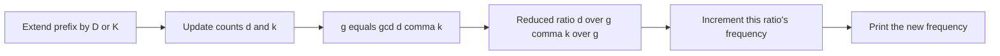

# Diluc and Kaeya

- Source: Codeforces
- USACO Guide ID: `cf-1536C`
- Difficulty at selection: Easy
- Original problem: [https://codeforces.com/problemset/problem/1536/C](https://codeforces.com/problemset/problem/1536/C)
- Tags: Divisibility, GCD, Prefix Counting
- Solution: [`../../solutions/cf-1536C.cpp`](../../solutions/cf-1536C.cpp)

## Problem Summary

For every prefix of a string containing only `D` and `K`, find the largest number of contiguous pieces into which that prefix can be divided so every piece has the same `D:K` ratio.

This is a paraphrase for study notes. Use the original link for the official statement and constraints.

## Visualization Description

Plot each prefix as a lattice point `(D count, K count)`. Reducing by the coordinates' gcd maps points on the same ray from the origin to one direction label. The first point on a ray represents one copy of that ratio, the second represents two copies, and so on. The number of previous visits to that reduced direction is the answer.

## Approach

Scan each test string once while counting `D` and `K`. At every prefix, divide both counts by their gcd to obtain a unique reduced ratio. Store frequencies of reduced pairs in a map and print the new frequency of the current ratio.

All-one-letter prefixes work without a special case: `gcd(d,0)=d` reduces them to `(1,0)`, and similarly all-`K` prefixes reduce to `(0,1)`.

## Correctness

Suppose a prefix can be split into `q` equal-ratio pieces with primitive ratio `(a,b)`. Its total counts are `(qa,qb)`, so its reduced ratio is `(a,b)`. Conversely, every earlier prefix with the same reduced ratio marks another whole multiple of `(a,b)`; differences between consecutive such prefixes also have counts proportional to `(a,b)`. Thus the occurrences of one reduced ratio identify exactly the consecutive equal-ratio pieces. The algorithm prints how many times that ratio has appeared, which is precisely the maximum number of valid pieces.

## Complexity

- Time: `O(n log n)` across map operations, with linear scanning
- Extra space: `O(n)`

## Verification

The smoke test covers the official multi-case sample. The exhaustive verifier enumerates every cut pattern for small random prefixes and directly checks whether all pieces have the same ratio before comparing the optimum with the C++ output.
