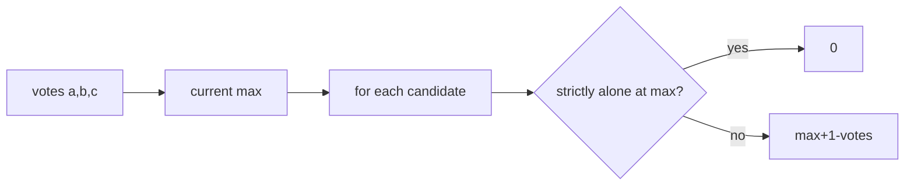

# Election

- Source: CF
- USACO Guide ID: `cf-1593A`
- Original problem: [https://codeforces.com/problemset/problem/1593/A](https://codeforces.com/problemset/problem/1593/A)
- Tags: Math
- Solution: [`../../solutions/cf-1593A.cpp`](../../solutions/cf-1593A.cpp)

## Problem Summary

For each candidate, compute the minimum extra votes needed to become strictly first.

This is a paraphrase for study notes. Use the original problem link for the official statement, constraints, and judge-specific details.

## Visualization Description

Raise each candidate's bar just above the tallest competing bar.

## Approach

A candidate needs zero extra votes only if they are already strictly greater than both others. Otherwise they need one more than the current maximum minus their current votes.

## Correctness Notes

The solution keeps the invariant described in the approach and updates only the state that can affect future answers. For query-style problems, preprocessing stores exactly the aggregate needed to answer each query. For graph and tree problems, each selected data structure operation mirrors one allowed change in the represented structure.

## Complexity

See the comments and structure of the C++ solution for the exact loop/data-structure cost. The intended complexity is efficient for the official constraints of the linked problem.

## Verification

Checked ties, one clear winner, and all equal.
