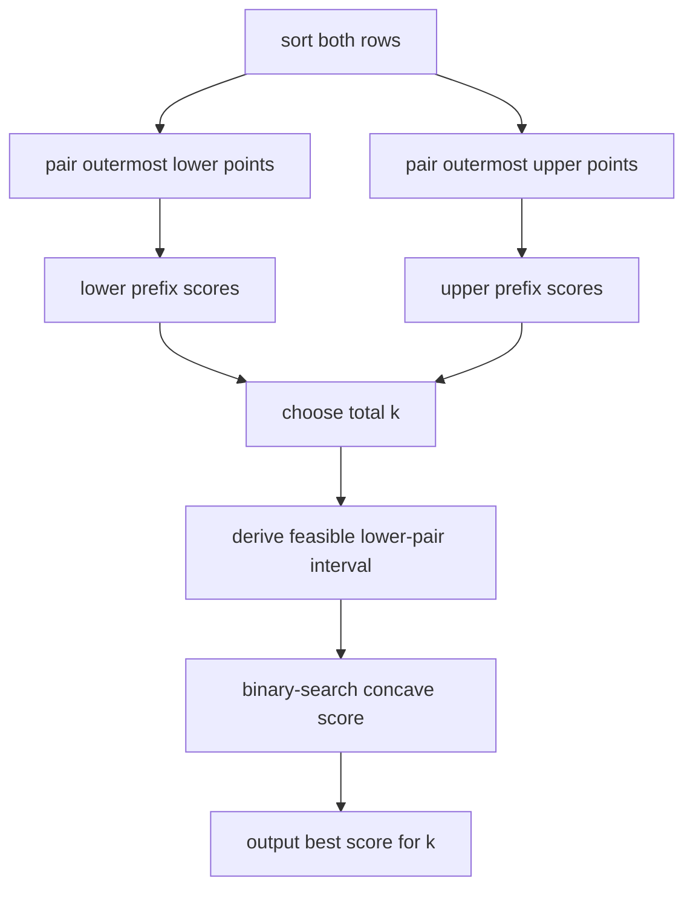

# Game With Triangles

- Source: Codeforces
- USACO Guide ID: `cf-2063D`
- Difficulty at selection: Easy (checked in [Guide source commit 81339ee](https://github.com/cpinitiative/usaco-guide/blob/81339eea4b5e43a0a1e26365f8dc8dfaa60f7705/content/4_Gold/Ternary_Search.problems.json))
- Original problem: [Codeforces 2063D](https://codeforces.com/problemset/problem/2063/D)
- Tags: Greedy Pairing, Prefix Sums, Discrete Concavity, Binary Search
- Solution: [C++](../../solutions/cf-2063D.cpp)

## Problem Summary

Points lie on two parallel horizontal lines. Each move removes three non-collinear points and adds their triangle's area to the score. Find the greatest possible number of moves, then independently maximize the score for every move count from one through that maximum.

This is a paraphrased study summary. Refer to the official page for the complete statement and constraints.

## Visualization Description

Draw each line as a sorted row of dots. A valid triangle must take two dots from one row and one from the other. Because the vertical distance is two, its area equals the horizontal distance between its same-row pair. Arcs connect the outermost unused dots on each row; those arc lengths form decreasing gain sequences. For a fixed number of triangles, slide a divider between “pairs from the lower row” and “pairs from the upper row” until their prefix-sum total reaches its peak.

## Approach

Sort each row. For one pair, the largest available base uses the two extremes. Repeating inward gives a decreasing sequence of pair gains, so store its prefix sums for both rows.

For exactly `k` triangles, suppose `x` use two lower-row points and `k-x` use two upper-row points. Feasibility requires `x + k <= n` and `2k - x <= m`, giving `max(0, 2k-m) <= x <= min(k, n-k)`. The score is `lower_prefix[x] + upper_prefix[k-x]`. Because both marginal-gain sequences decrease, this function is concave in `x`; compare neighboring values to binary-search its maximum.

The maximum number of triangles is `min(n, m, (n+m)/3)`: every triangle needs at least one point from each row and three points total, and these conditions are sufficient.

## Correctness

For any fixed number of pairs selected from one sorted row, uncrossing or widening a pair never reduces its length. Thus repeatedly pairing the leftmost and rightmost remaining coordinates maximizes the total base length, and each prefix score is optimal.

Every valid set of `k` triangles is described by some feasible `x`: `x` lower-row pairs and `k-x` upper-row pairs. Conversely, every `x` in the derived interval respects both row capacities and produces `k` triangles. Its best score is exactly the sum of the two optimal prefix scores. Their decreasing marginal gains make the sum concave, so neighboring-value binary search preserves a maximum and returns the best feasible `x`. Therefore every printed `f(k)` is optimal.

## Complexity

- Time: `O((N + M) log(N + M) + K log(N + M))`
- Space: `O(N + M)`

## Verification

The smoke test uses all five official examples. The independent verifier enumerates every possible triangle choice on many small point sets, compares every attainable move count, and includes extreme coordinates whose total score exceeds 32-bit range.
