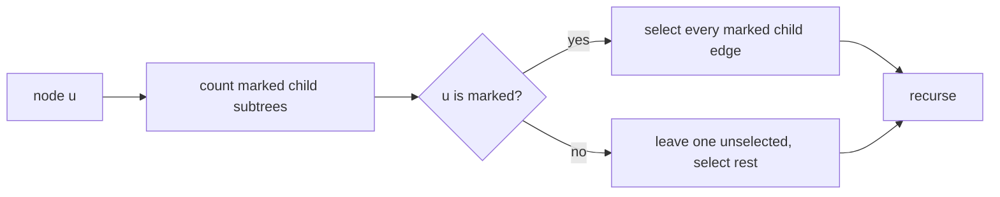

# Spying On The Beaver

- Source: CF
- USACO Guide ID: `cf-2257C`
- Original problem: [https://codeforces.com/problemset/problem/2257/C](https://codeforces.com/problemset/problem/2257/C)
- Tags: Tree, Greedy
- Solution: [`../../solutions/cf-2257C.cpp`](../../solutions/cf-2257C.cpp)

## Problem Summary

Place the minimum number of cameras on rooted-tree edges so the set of observed camera edges uniquely identifies which marked destination was reached.

This is a paraphrase for study notes. Use the original problem link for the official statement, constraints, and judge-specific details.

## Visualization Description

A selected edge gives every destination below it one extra bit of identity. At each branching point, all but possibly one marked branch need a new bit; if the branch point is also a destination, every marked branch needs one.

## Approach

Two destination groups below different child subtrees of a node need different observations before they diverge. If the current node itself is a destination, every marked child subtree needs its entering edge selected; otherwise one child subtree can inherit the current observation code and all other marked child subtrees need selected entering edges. Apply this independently bottom-up/top-down over all nodes with marked descendants.

## Correctness Notes

The solution keeps the invariant described in the approach and updates only the state that can affect future answers. For query-style problems, preprocessing stores exactly the aggregate needed to answer each query. For graph and tree problems, each selected data structure operation mirrors one allowed change in the represented structure.

## Complexity

See the comments and structure of the C++ solution for the exact loop/data-structure cost. The intended complexity is efficient for the official constraints of the linked problem.

## Verification

Checked against the Codeforces sample structure and tiny ancestor/branching cases.
