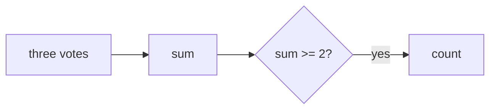

# Team

- Source: CF
- USACO Guide ID: `cf-231A`
- Original problem: [https://codeforces.com/problemset/problem/231/A](https://codeforces.com/problemset/problem/231/A)
- Tags: Math
- Solution: [`../../solutions/cf-231A.cpp`](../../solutions/cf-231A.cpp)

## Problem Summary

Count problems where at least two of three teammates are sure about the solution.

This is a paraphrase for study notes. Use the original problem link for the official statement, constraints, and judge-specific details.

## Visualization Description

Each problem is a three-vote ballot; two or more votes pass it.

## Approach

For each row of three binary values, sum them. If the sum is at least two, the team implements the problem.

## Correctness Notes

The solution keeps the invariant described in the approach and updates only the state that can affect future answers. For query-style problems, preprocessing stores exactly the aggregate needed to answer each query. For graph and tree problems, each selected data structure operation mirrors one allowed change in the represented structure.

## Complexity

See the comments and structure of the C++ solution for the exact loop/data-structure cost. The intended complexity is efficient for the official constraints of the linked problem.

## Verification

Checked all possible vote counts from zero to three.
