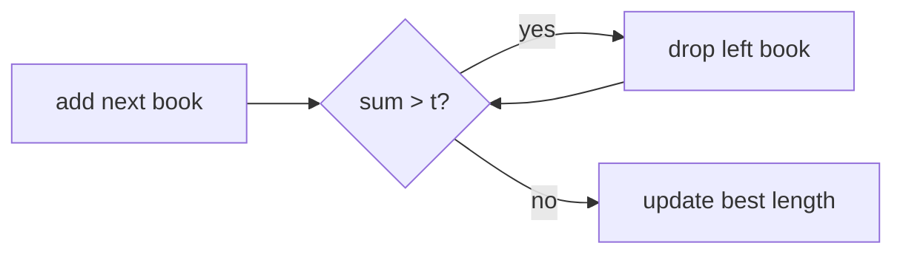

# Books

- Source: CF
- USACO Guide ID: `cf-279B`
- Original problem: [https://codeforces.com/contest/279/problem/B](https://codeforces.com/contest/279/problem/B)
- Tags: Two Pointers
- Solution: [`../../solutions/cf-279B.cpp`](../../solutions/cf-279B.cpp)

## Problem Summary

Find the longest contiguous block of books readable within total time t.

This is a paraphrase for study notes. Use the original problem link for the official statement, constraints, and judge-specific details.

## Visualization Description

A window expands over consecutive books until it exceeds the time budget, then slides forward.

## Approach

All reading times are positive, so a sliding window works. Add each right endpoint, shrink the left endpoint while the sum exceeds t, and track the maximum window length.

## Correctness Notes

The solution keeps the invariant described in the approach and updates only the state that can affect future answers. For query-style problems, preprocessing stores exactly the aggregate needed to answer each query. For graph and tree problems, each selected data structure operation mirrors one allowed change in the represented structure.

## Complexity

See the comments and structure of the C++ solution for the exact loop/data-structure cost. The intended complexity is efficient for the official constraints of the linked problem.

## Verification

Checked all books fit, no book fits, and several best windows.
