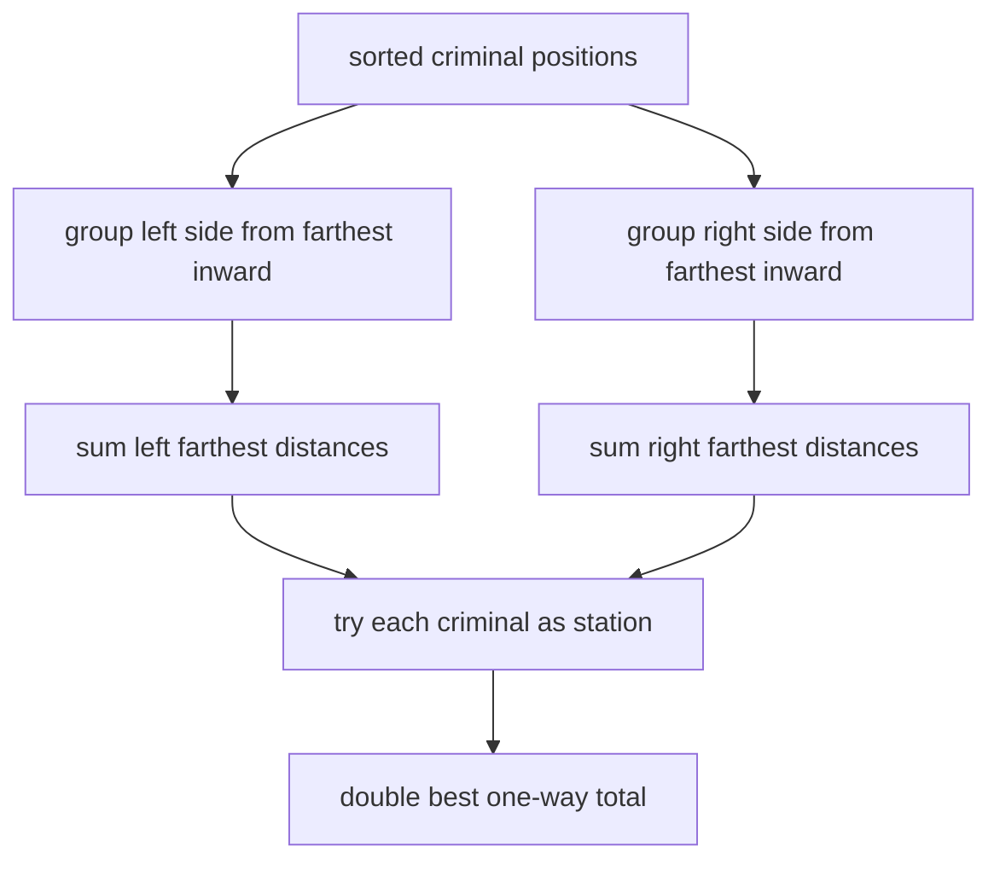

# Police Patrol

- Source: Codeforces
- USACO Guide ID: `cf-427E`
- Difficulty at selection: Easy (checked in [Guide source commit 7bf6d95](https://github.com/cpinitiative/usaco-guide/blob/7bf6d95ba5cbca9c37bc5cb96514a80b134bd4a5/content/4_Gold/Ternary_Search.problems.json))
- Original problem: [Codeforces 427E](https://codeforces.com/problemset/problem/427/E)
- Tags: Greedy Grouping, Linear Sweep, Convexity
- Solution: [C++](../../solutions/cf-427E.cpp)

## Problem Summary

Criminals stand at sorted integer positions on a line. Choose a station position for one car that can carry at most `M` criminals. Every collecting trip starts and ends at the station; minimize the total distance needed to collect everyone.

This is a paraphrased study summary. Refer to the official page for the complete statement and constraints.

## Visualization Description

Place the station at a marked criminal. On the left, bracket criminals into capacity-sized groups beginning at the farthest end; only the farthest point of each bracket determines that round trip. Do the mirrored grouping on the right. Sliding the station marker across all criminal positions reveals the smallest sum of left and right trip distances.

## Approach

For a fixed station, handle its two sides independently. On one side, the car should collect the farthest remaining criminal, then up to `M-1` closer criminals on the return route. Thus the left trip leaders have indices `0, M, 2M, ...`; the right leaders are the mirrored sequence from `N-1`.

Sweep possible station indices. Maintain the number and coordinate sum of active trip leaders so each side's one-way distance is computed in constant time. A best station may be chosen at a criminal position because between neighboring positions the groups do not change and the distance is linear.

## Correctness

On either side, every trip reaching a farthest criminal can pick up as many as `M-1` closer criminals without extra travel. Filling those trips farthest-first cannot hurt and yields leaders spaced exactly `M` indices apart.

For station `i`, `left_cost[i]` sums `position[i] - position[leader]` over every left leader, and `right_cost[i]` sums the mirrored distances. These are exactly the outbound halves of all required trips. The two sides are independent, so their sums give the complete one-way travel for that station. Testing every criminal position finds an optimal endpoint of every linear interval, and doubling accounts for each return journey.

## Complexity

- Time: `O(N)`
- Space: `O(N)`

## Verification

The smoke test includes an official sample. The independent verifier tries every integer station on small random inputs and compares against direct farthest-first grouping. It also covers duplicates, capacity one, capacity at least `N`, large coordinates, and a million-position scaling case.
