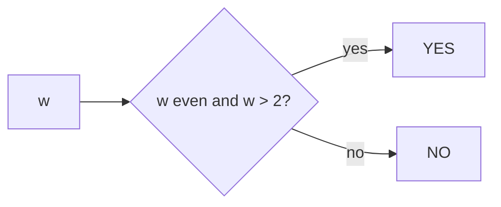

# Watermelon

- Source: CF
- USACO Guide ID: `cf-4A`
- Original problem: [https://codeforces.com/problemset/problem/4/A](https://codeforces.com/problemset/problem/4/A)
- Tags: Math
- Solution: [`../../solutions/cf-4A.cpp`](../../solutions/cf-4A.cpp)

## Problem Summary

Decide whether an even weight can be split into two positive even parts.

This is a paraphrase for study notes. Use the original problem link for the official statement, constraints, and judge-specific details.

## Visualization Description

Reserve 2 for one person; the remainder must also be positive and even.

## Approach

The smallest positive even part is 2. Therefore the split is possible exactly when w is even and greater than 2.

## Correctness Notes

The solution keeps the invariant described in the approach and updates only the state that can affect future answers. For query-style problems, preprocessing stores exactly the aggregate needed to answer each query. For graph and tree problems, each selected data structure operation mirrors one allowed change in the represented structure.

## Complexity

See the comments and structure of the C++ solution for the exact loop/data-structure cost. The intended complexity is efficient for the official constraints of the linked problem.

## Verification

Checked w=2, odd weights, and larger even weights.
