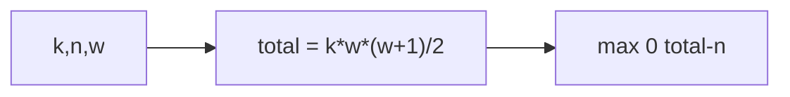

# Soldier and Bananas

- Source: CF
- USACO Guide ID: `cf-546A`
- Original problem: [https://codeforces.com/problemset/problem/546/A](https://codeforces.com/problemset/problem/546/A)
- Tags: Math
- Solution: [`../../solutions/cf-546A.cpp`](../../solutions/cf-546A.cpp)

## Problem Summary

Compute how much money is missing to buy bananas with linearly increasing prices.

This is a paraphrase for study notes. Use the original problem link for the official statement, constraints, and judge-specific details.

## Visualization Description

Banana prices form a staircase; sum the staircase and compare it to the wallet.

## Approach

The total cost is k * (1 + 2 + ... + w) = k*w*(w+1)/2. Borrowing needed is max(0, total - current money).

## Correctness Notes

The solution keeps the invariant described in the approach and updates only the state that can affect future answers. For query-style problems, preprocessing stores exactly the aggregate needed to answer each query. For graph and tree problems, each selected data structure operation mirrors one allowed change in the represented structure.

## Complexity

See the comments and structure of the C++ solution for the exact loop/data-structure cost. The intended complexity is efficient for the official constraints of the linked problem.

## Verification

Checked cases requiring no borrow and positive borrow.
