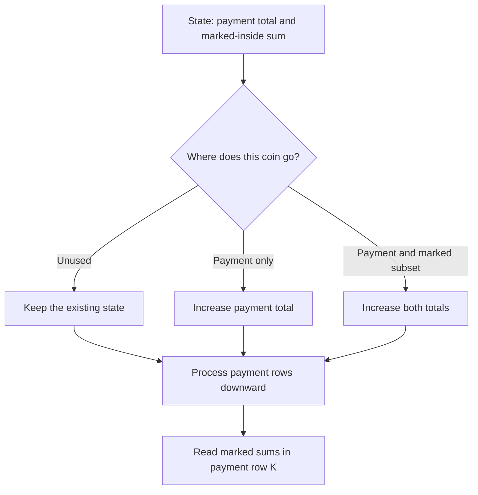

# The Values You Can Make

- Source: CF
- USACO Guide ID: `cf-687C`
- Difficulty at selection: Easy (checked in [Guide source commit 8671909](https://github.com/cpinitiative/usaco-guide/blob/86719090e74da7a51af284038c0a7ebf6636ce8e/content/4_Gold/Knapsack_DP.problems.json))
- Original problem: [The Values You Can Make](https://codeforces.com/contest/687/problem/C)
- Tags: Dynamic Programming, 0/1 Knapsack, Bitsets
- Solution: [C++](../../solutions/cf-687C.cpp)

## Problem Summary

Choose a payment subset of physical coins totaling K. Find every amount that can be formed by a further subset inside at least one such valid payment.

This summary is paraphrased for study. Refer to the official problem for complete rules and constraints.

## Visualization Description

Draw a grid with payment total along the vertical axis and marked-inside total along the horizontal axis. The origin is lit. A coin v has three possible arrows from each lit cell: stay put when unused, move down by v when included only in the payment, or move diagonally down-right by v when also marked. Shade the row for payment K; its lit columns are the answer. For coins 2 and 3 with K=5, the highlighted row contains inside sums 0,2,3,5. Animate rows from K downward so the current coin cannot travel twice.

## Approach

Use a bitset for each payment total p. Bit x in possible[p] records that some payment of p contains a marked subset totaling x. Start with possible[0][0]=true. For coin v and p descending from K to v, merge possible[p-v] and possible[p-v]<<v into possible[p]. The first source selects v for the payment only; the shifted source selects it for both payment and marked subset. Existing bits skip the coin. Read all set bits 0..K from possible[K].

## Correctness

Initially the empty payment and empty marked subset establish exactly state (0,0). Every assignment of a new coin puts it in one of three disjoint roles: unused, selected for the payment only, or selected for both the payment and its marked subset. The three transitions represent these roles and preserve a marked subset inside the payment. Conversely, removing the new coin from any feasible assignment gives a valid previous state represented by the transition. Descending payment totals ensure all source rows precede this coin. Induction proves the reachable-state invariant, so the final K row contains exactly the requested values.

## Complexity

Time: O(NK⌈(K+1)/w⌉) bit-word operations, where w is the machine word width. The fixed bitset has 501 bits. Space: O(K²) bits, with K+1 rows. A plain boolean implementation would take O(NK²) time.

## Verification

Both official samples are smoke-tested. A ternary assignment oracle gives each small coin one of the three roles directly, independently of the DP. Duplicate coins, a value above K, K=1, and a one-coin payment are covered. Maximum-size cases of 500 unit coins and 500 coins of value 500 exercise bit shifts and row bounds.
