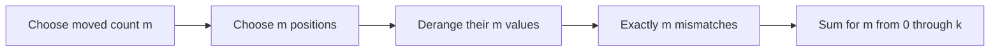

# Almost Identity Permutations

- Source: Codeforces
- USACO Guide ID: `cf-888D`
- Difficulty at selection: Easy
- Original problem: [https://codeforces.com/problemset/problem/888/D](https://codeforces.com/problemset/problem/888/D)
- Tags: Combinatorics, Derangements
- Solution: [`../../solutions/cf-888D.cpp`](../../solutions/cf-888D.cpp)

## Problem Summary

Count the permutations of `1..n` in which at most `k` positions contain a value different from their own index. The limits `n <= 1000` and `k <= 4` make it possible to count by the exact number of changed positions.

This is a paraphrase for study notes. Use the original link for the official statement and constraints.

## Visualization Description

Start with identity cards `1,2,...,n` in matching numbered slots. Circle exactly `m` slots that will change. The uncircled cards stay home. Inside the circle, arrange the selected cards so that none returns to its original slot—a derangement.

## Approach

For each `m` from `0` to `k`, choose the mismatching positions in `C(n,m)` ways. Their values must form a derangement, or a selected position that stays fixed would actually belong to a smaller `m` case. The needed derangement counts are tiny and fixed: `D(0..4) = 1, 0, 1, 2, 9`. Add `C(n,m)D(m)` over all allowed `m`.

The code evaluates each small binomial coefficient as an exact multiplicative product. The maximum answer easily fits in a signed 64-bit integer.

## Correctness

Consider any valid permutation and let `m` be its exact number of mismatching positions. The algorithm selects precisely that set in one of its `C(n,m)` choices. Values outside the set are fixed, while the selected values form a derangement; otherwise at least one selected position would match. Thus the permutation appears once in the term `C(n,m)D(m)`. Conversely, each chosen set paired with a derangement produces a permutation with exactly `m <= k` mismatches. The cases for different `m` are disjoint, so their sum counts every valid permutation exactly once.

## Complexity

- Time: `O(k^2)`, with `k <= 4`
- Extra space: `O(1)`

## Verification

Smoke coverage includes the official `n=5, k=4` case. Exhaustive verification generates every permutation for `n` from 4 through 8, counts fixed positions directly, and compares all four allowed values of `k`.
