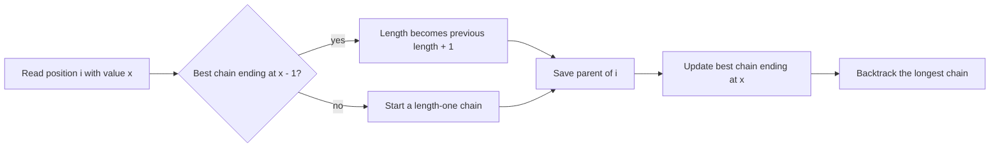

# Consecutive Subsequence

- Source: Codeforces
- USACO Guide ID: `cf-977F`
- Difficulty at selection: Easy (checked in [Guide source commit ecd27b6](https://github.com/cpinitiative/usaco-guide/blob/ecd27b6eff69112891eabf0c968d3ad0b2a7f745/content/4_Gold/LIS.problems.json))
- Original problem: [Codeforces 977F — Consecutive Subsequence](https://codeforces.com/contest/977/problem/F)
- Tags: Dynamic Programming, Hash Map, Reconstruction
- Solution: [C++](../../solutions/cf-977F.cpp)

## Problem Summary

Choose as many array positions as possible, without changing their order, so the chosen values rise by exactly one at every step. Output both the maximum length and one valid sequence of original indices.

This summary is paraphrased for study. Refer to the official problem for the full statement and constraints.

## Visualization Description

Imagine a labeled chain ending at every value seen so far. When value `x` arrives, it can attach only to the best earlier chain labeled `x-1`. Store that chain's length and final index, then draw a parent arrow from the new position to the old final index. The longest chain of arrows gives the answer.

## Approach

For every ending value, keep the maximum length of a valid chain with that value and the index of its last element. At array position `i` with value `x`, the only possible preceding value is `x-1`, so the candidate length is `best[x-1]+1`, or one if no predecessor exists. Save the predecessor index as `parent[i]`. Update the record for `x` when the candidate is better. Finally, follow parent pointers from the best ending index and reverse the collected indices.

## Correctness

Any valid chain ending at `x` must use an earlier valid chain ending at `x-1`; no other value can precede `x`. The algorithm attaches `x` to the longest such earlier chain, so it constructs the longest valid chain ending at this occurrence. Keeping the best result for every ending value preserves exactly the information future values need. Thus the largest stored length is globally optimal. Every saved parent points to an earlier index whose value is one smaller, so backtracking produces a valid maximum-length subsequence in increasing index order.

## Complexity

- Expected time: `O(N)` with hash maps
- Space: `O(N)`

## Verification

The smoke test uses a unique full chain. The independent verifier enumerates every subsequence of many short arrays, then validates the reported length, indices, order, and consecutive values. A maximum-size increasing chain checks linear scaling and reconstruction.
