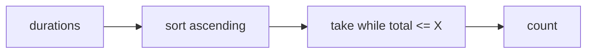

# Studying Algorithms

- Source: CF
- USACO Guide ID: `cfgym-102951B`
- Original problem: [https://codeforces.com/gym/102951/problem/B](https://codeforces.com/gym/102951/problem/B)
- Tags: Greedy, Sorting
- Solution: [`../../solutions/cfgym-102951B.cpp`](../../solutions/cfgym-102951B.cpp)

## Problem Summary

Choose the maximum number of algorithms to study within a fixed time budget.

This is a paraphrase for study notes. Use the original problem link for the official statement, constraints, and judge-specific details.

## Visualization Description

Pack the smallest time blocks into the budget bar before considering larger blocks.

## Approach

To maximize the count, study the shortest algorithms first. If an optimal answer used a longer algorithm while skipping a shorter one, swapping them would not increase time and would keep the count. Sort durations and greedily take while the budget allows.

## Correctness Notes

The solution keeps the invariant described in the approach and updates only the state that can affect future answers. For query-style problems, preprocessing stores exactly the aggregate needed to answer each query. For graph and tree problems, each selected data structure operation mirrors one allowed change in the represented structure.

## Complexity

See the comments and structure of the C++ solution for the exact loop/data-structure cost. The intended complexity is efficient for the official constraints of the linked problem.

## Verification

Checked the Codeforces sample and budgets that stop exactly at an item boundary.
