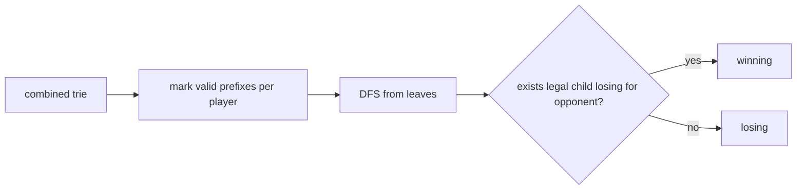

# Vlak

- Source: COCI
- USACO Guide ID: `coci-21-vlak`
- Original problem: [https://oj.uz/problem/view/COCI20_vlak](https://oj.uz/problem/view/COCI20_vlak)
- Tags: Trie, DP, Game Theory
- Solution: [`../../solutions/coci-21-vlak.cpp`](../../solutions/coci-21-vlak.cpp)

## Problem Summary

Two players append letters to a growing word. On each turn, the current word must be a prefix of one of that player's own words. The player unable to move loses.

This is a paraphrase for study notes. Use the original problem link for the official statement, constraints, and judge-specific details.

## Visualization Description

The trie is the game board. Nina can move only along edges into Nina-marked prefixes; Emilija can move only into Emilija-marked prefixes.

## Approach

Insert both players' word sets into one trie, marking every node that is a valid prefix for Nina and/or Emilija. A state is the current trie node and the player to move. It is winning for that player if there is at least one child that is valid for that player and losing for the other player. Compute these states bottom-up.

## Correctness Notes

The solution keeps the invariant described in the approach and updates only the state that can affect future answers. For query-style problems, preprocessing stores exactly the aggregate needed to answer each query. For graph and tree problems, each selected data structure operation mirrors one allowed change in the represented structure.

## Complexity

See the comments and structure of the C++ solution for the exact loop/data-structure cost. The intended complexity is efficient for the official constraints of the linked problem.

## Verification

Checked tiny games where one player has no first move and shared-prefix games where the winning move changes by turn.
