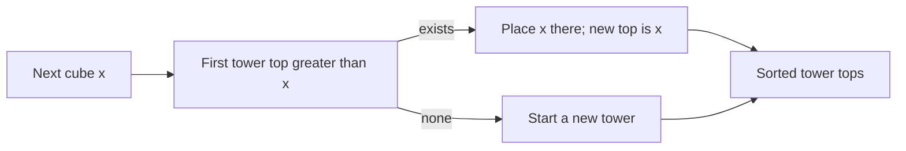

# Towers

- Source: CSES
- USACO Guide ID: `cses-1073`
- Difficulty at selection: Easy (checked in [Guide source commit ecd27b6](https://github.com/cpinitiative/usaco-guide/blob/ecd27b6eff69112891eabf0c968d3ad0b2a7f745/content/4_Gold/LIS.problems.json))
- Original problem: [CSES — Towers](https://cses.fi/problemset/task/1073)
- Tags: Greedy, Binary Search, Longest Increasing Subsequence
- Solution: [C++](../../solutions/cses-1073.cpp)

## Problem Summary

Cubes arrive in a fixed order. Each cube must start a tower or be placed on a tower whose current top is strictly larger. Find the minimum number of towers needed after processing every cube.

This summary is paraphrased for study. Refer to the official problem for the full statement and constraints.

## Visualization Description

Show the exposed tower tops as a sorted row. When cube `x` arrives, point to the first top strictly greater than `x` and replace it with `x`. If the pointer falls past the row, create a new tower. Equal tops are skipped because an equal cube cannot sit below the new one under the strict rule.

## Approach

Keep the current tower tops sorted. For an arriving cube `x`, `upper_bound` finds the smallest exposed top strictly greater than `x`. Replace that top with `x`; if none exists, append a new tower. The smallest legal top is the safest choice because it preserves every larger top for harder future cubes.

## Correctness

If no current top exceeds `x`, no existing tower can accept it, so every valid construction must add a tower. Otherwise let `t` be the smallest top greater than `x`. Placing `x` there is legal. Compared with placing it on any larger legal top, this choice leaves the multiset of exposed tops no larger at every sorted position, so it cannot reduce the options for any later cube. By applying this exchange at every step, an optimal construction can follow the greedy choice throughout. Therefore the final number of stored tops is minimum.

## Complexity

- Time: `O(N log N)`
- Space: `O(N)`

## Verification

The official sample is smoke-tested. A memoized exhaustive oracle tries every legal tower for short random inputs. Cases emphasize equal sizes, increasing and decreasing streams, repeated interleavings, and the maximum input size.
