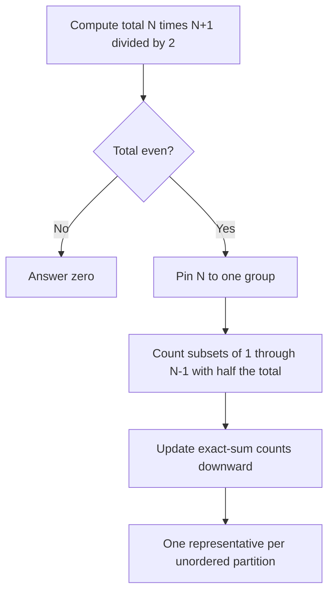

# Two Sets II

- Source: CSES
- USACO Guide ID: `cses-1093`
- Difficulty at selection: Easy (checked in [Guide source commit 8671909](https://github.com/cpinitiative/usaco-guide/blob/86719090e74da7a51af284038c0a7ebf6636ce8e/content/4_Gold/Knapsack_DP.problems.json))
- Original problem: [Two Sets II](https://cses.fi/problemset/task/1093)
- Tags: Dynamic Programming, 0/1 Knapsack, Counting
- Solution: [C++](../../solutions/cses-1093.cpp)

## Problem Summary

Count unordered ways to split the integers from 1 through N into two groups with the same sum. Report the count modulo 1,000,000,007.

This summary is paraphrased for study. Refer to the official problem for complete rules and constraints.

## Visualization Description

Draw numbers 1 through N as cards beside two equal-size sum bars. Pin card N to the right group. The left group must fill a bar of height N(N+1)/4 using cards 1 through N-1. Beneath it, draw a row of exact-sum counters. For each card v, highlight arrows from sum s-v to sum s while sweeping from right to left. Use a different color for keeping a card out versus placing it in the left group. With N=3, pin 3 right and highlight the single left selection {1,2}.

## Approach

If the total T=N(N+1)/2 is odd, no equal split exists. Otherwise count subsets of 1..N-1 totaling T/2. Define ways[s] as the number of subsets of processed values with exact sum s. Initially ways[0]=1. For each v, update ways[s] += ways[s-v] modulo M, scanning s downward. Excluding N selects exactly the side without N from every unordered partition; its complement automatically contains N and has the same sum.

## Correctness

Every equal-sum unordered partition has exactly one side that excludes N. This gives a bijection between partitions and subsets of 1..N-1 totaling T/2. For the DP, initially the empty subset is the only subset. On processing v, each subset either skips v or includes it with an earlier subset of sum s-v. These disjoint cases are exhaustive. Descending sum preserves earlier-value states, so v is used at most once. Induction establishes all counters, and ways[T/2] therefore counts every partition exactly once.

## Complexity

Time: O(NT), where T=N(N+1)/2, equivalently O(N³). Space: O(T), equivalently O(N²). At N=500 the half-sum is 62,625.

## Verification

Official sample N=7 gives 4. Independent exhaustive subset enumeration covers N=1..20 with complement-pair counting. A separate all-N subset-count DP followed by multiplication by the modular inverse of two checks larger cases including N=500. Cases cover odd totals, the first valid split, and modular wraparound.
