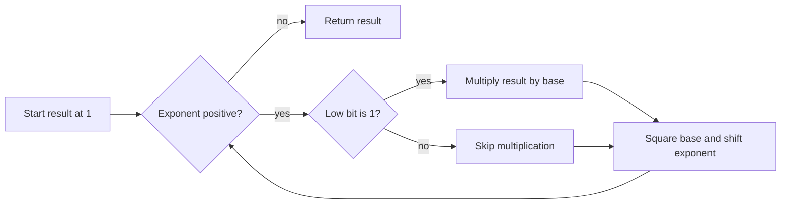

# Exponentiation

- Source: CSES
- USACO Guide ID: `cses-1095`
- Difficulty at selection: Easy
- Original problem: [https://cses.fi/problemset/task/1095](https://cses.fi/problemset/task/1095)
- Tags: Modular Arithmetic, Binary Exponentiation
- Solution: [`../../solutions/cses-1095.cpp`](../../solutions/cses-1095.cpp)

## Problem Summary

Answer many independent queries asking for `a^b` modulo `1,000,000,007`. Both values can be large enough that multiplying `a` by itself `b` times is much too slow. The special case `0^0` is defined as `1`.

This is a paraphrase for study notes. Use the original link for the official statement and constraints.

## Visualization Description

Write the exponent as a sum of powers of two. A row of boxes holds `a^1, a^2, a^4, a^8, ...`; every step squares the previous box. Highlight only the boxes corresponding to set bits of `b`, then multiply those highlighted values modulo `1,000,000,007`.

## Approach

Binary exponentiation processes one bit of `b` per loop. The current base starts as `a` and represents `a^(2^j)` at bit position `j`. If that bit of `b` is set, multiply it into the answer. Then square the base and shift `b` right. Reducing each product modulo the target keeps the intermediate numbers bounded.

## Correctness

At the beginning of each loop, `result * base^exponent` is congruent to the original `a^b`. If the low bit is set, moving one copy of `base` into `result` removes that odd part. Squaring `base` and halving the remaining exponent preserves the product because `(base^2)^(exponent/2) = base^exponent` when the remaining exponent is even. When the exponent becomes zero, the invariant leaves `result` congruent to the requested power. Starting at one also gives the required answer for exponent zero.

## Complexity

For each query:

- Time: `O(log b)`
- Extra space: `O(1)`

## Verification

The smoke test includes the official example plus zero-exponent cases. Deterministic verification compares the program with Python's independent modular-power operation for a grid of small values and boundary-sized values, including `0^0`, base zero, exponent zero, and large exponents.
