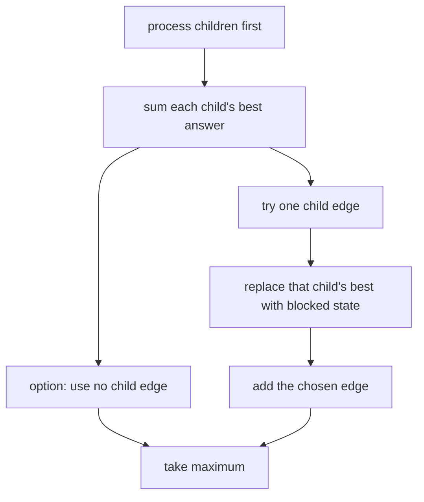

# Tree Matching

- Source: CSES
- USACO Guide ID: `cses-1130`
- Difficulty at selection: Easy (checked in [Guide source commit ed367e8](https://github.com/cpinitiative/usaco-guide/blob/ed367e8953e137e603d09a36fd7040dcf2e30667/content/4_Gold/DP_Trees.problems.json))
- Original problem: [CSES Tree Matching](https://cses.fi/problemset/task/1130)
- Tags: Tree DP, Matching
- Solution: [C++](../../solutions/cses-1130.cpp)

## Problem Summary

Choose as many tree edges as possible while ensuring that no vertex belongs to more than one chosen edge.

This is a paraphrased study summary. Refer to the official page for the complete statement and constraints.

## Visualization Description

Root the tree and place two number cards beside every vertex. The first card assumes the vertex cannot connect downward; the second lets it connect to at most one child. When an edge to one child lights up, all other child subtrees remain independent, while that child's downward edge choices switch off.

## Approach

For each vertex `v`, let `blocked[v]` be the best matching in its subtree when `v` cannot match a child. It equals the sum of `best[child]`. Let `best[v]` allow `v` to match zero or one child. Start it at `blocked[v]`, then try each child `u`: remove `best[u]`, add `blocked[u]`, and add one for edge `(v,u)`. Build a parent/order array iteratively and evaluate it backward.

## Correctness

If `v` uses no child edge, child subtrees do not interact, so their optimal `best` values sum to `blocked[v]`. If `v` uses a child edge, matching rules allow exactly one such child `u`; `u` must then use its blocked state, while every other child retains its best state. The transition checks every permitted choice of `u`, plus choosing none. Induction from leaves to the root proves both states optimal, so `best[root]` is the maximum tree matching.

## Complexity

- Time: `O(N)`
- Space: `O(N)`

## Verification

The smoke test uses the official sample. The independent verifier enumerates every subset of edges on many small random trees and compares the largest legal subset with the C++ output. Long chains additionally check iterative traversal and maximum-depth safety.
