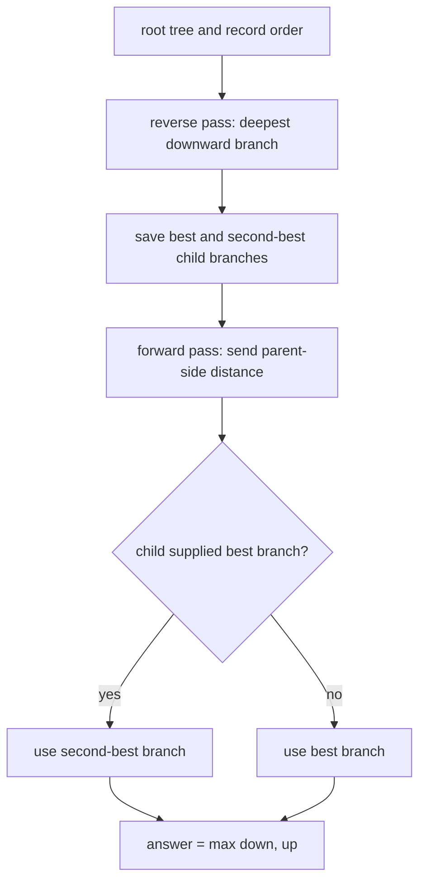

# Tree Distances I

- Source: CSES
- USACO Guide ID: `cses-1132`
- Difficulty at selection: Easy (checked in [Guide source commit 74a8cf6](https://github.com/cpinitiative/usaco-guide/blob/74a8cf603185c1cb84020b7a483a0e1bacef186e/content/4_Gold/All_Roots.problems.json))
- Original problem: [CSES Tree Distances I](https://cses.fi/problemset/task/1132)
- Tags: Tree DP, Rerooting, DFS
- Solution: [C++](../../solutions/cses-1132.cpp)

## Problem Summary

For every vertex of an unweighted tree, find the largest number of edges on a path from that vertex to any other vertex.

This is a paraphrased study summary. Refer to the official page for the complete statement and constraints.

## Visualization Description

Root the tree once and draw two arrows beside every vertex. A downward arrow reaches the deepest descendant. An upward arrow first crosses the parent edge, then may continue upward or turn into a sibling branch. Highlight the tallest and second-tallest child branches so a child never sends the rerooted path back into its own subtree.

## Approach

Build parent and traversal arrays iteratively. In reverse order, compute `downward[v]`, the farthest distance inside `v`'s subtree. Keep the best two child branches and the child responsible for the best. In forward order, compute `upward[child]` by crossing to its parent and choosing the parent's upward path or its best branch that does not return through this child. The answer is `max(downward[v], upward[v])`.

## Correctness

Every path starting at `v` falls into exactly one of two groups: it remains inside `v`'s rooted subtree, or its first edge goes to `v`'s parent. The reverse pass finds the longest path in the first group by induction on subtree height. For a child, every path in the second group crosses to the parent and then either stops, continues toward an ancestor, or enters a sibling subtree. The forward transition checks exactly these choices and excludes the child's own branch. Induction from the root downward therefore proves `upward` correct. Taking the larger group maximum gives the farthest distance for every vertex.

## Complexity

- Time: `O(N)`
- Space: `O(N)`

## Verification

The smoke test uses the official sample. The independent verifier compares the C++ output with all-pairs breadth-first distances on many small random trees. A maximum-size path checks the iterative traversal and every output position.
