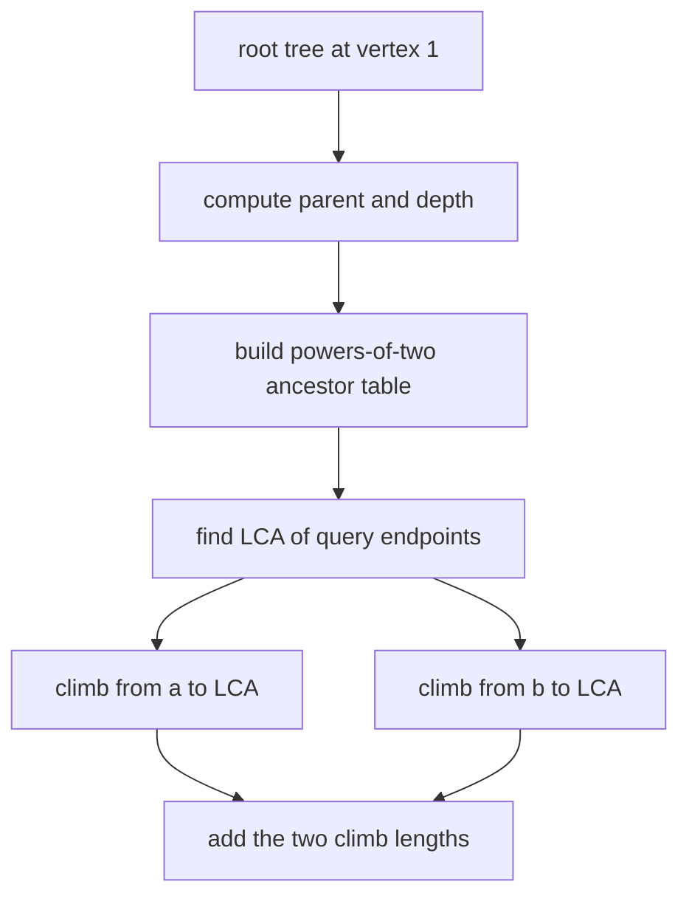

# Distance Queries

- Source: CSES
- USACO Guide ID: `cses-1135`
- Difficulty at selection: Easy (checked in [Guide source commit e8b01d6](https://github.com/cpinitiative/usaco-guide/blob/e8b01d6c58badcabbdd922b15d408d76e2beebf1/content/4_Gold/LCA_Euler.problems.json))
- Original problem: [CSES Distance Queries](https://cses.fi/problemset/task/1135)
- Tags: Lowest Common Ancestor, Binary Lifting, Tree Distance
- Solution: [C++](../../solutions/cses-1135.cpp)

## Problem Summary

Given an unweighted tree, answer many requests for the number of edges on the unique route between two specified vertices.

This is a paraphrased study summary. Refer to the official page for the complete statement and constraints.

## Visualization Description

Root the tree at vertex 1 and color the root-to-`a` route blue and the root-to-`b` route orange. Their shared prefix ends at the lowest common ancestor. Label each vertex with its depth. The required path is the two nonshared route pieces, so the final equation reads `depth[a] + depth[b] - 2 * depth[lca]`.

## Approach

Use an iterative traversal from vertex 1 to determine each vertex's parent and depth. Build `up[k][v]`, the ancestor `2^k` edges above `v`.

For each request, find the lowest common ancestor with binary lifting: level the deeper endpoint, then jump both upward from large powers to small while their target ancestors differ. If the LCA is `c`, the path length is `depth[a] - depth[c] + depth[b] - depth[c]`.

The traversal is iterative so a 200,000-vertex path cannot overflow the program stack.

## Correctness

Binary lifting finds the LCA because leveling puts both endpoints at equal depth without changing their common ancestors. The descending jump scan moves them as high as possible while keeping them distinct, leaving both immediately below their lowest common ancestor.

In a tree, the unique route from `a` to `b` climbs from `a` to `c = LCA(a,b)` and then descends from `c` to `b`. Those pieces contain `depth[a] - depth[c]` and `depth[b] - depth[c]` edges and overlap only at `c`. Their sum is exactly `depth[a] + depth[b] - 2 * depth[c]`, which the algorithm prints.

## Complexity

- Traversal and preprocessing: `O(N log N)` time
- Each query: `O(log N)` time
- Space: `O(N log N)`

## Verification

The smoke test uses the official sample. The independent verifier compares random queries with breadth-first shortest-path distances on small trees. A maximum-size path checks iterative preprocessing, deepest ancestors, same-vertex requests, and endpoint distance.
