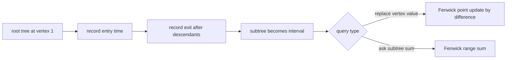

# Subtree Queries

- Source: CSES
- USACO Guide ID: `cses-1137`
- Difficulty at selection: Easy (checked in [Guide source commit 74a8cf6](https://github.com/cpinitiative/usaco-guide/blob/74a8cf603185c1cb84020b7a483a0e1bacef186e/content/4_Gold/Tree_Euler.problems.json))
- Original problem: [CSES Subtree Queries](https://cses.fi/problemset/task/1137)
- Tags: Euler Tour, Fenwick Tree, Point Update, Range Sum
- Solution: [C++](../../solutions/cses-1137.cpp)

## Problem Summary

A tree is rooted at vertex 1, and every vertex stores a value. Process online operations that either replace one vertex's value or ask for the sum of all values in one rooted subtree.

This is a paraphrased study summary. Refer to the official page for the complete statement and constraints.

## Visualization Description

Draw the rooted tree on the left. Number vertices in the order a depth-first traversal first enters them, then place those vertices in a horizontal array on the right. Give every subtree a matching colored bracket in both views. Each bracket becomes one uninterrupted array interval. A value replacement changes one cell, while a subtree request highlights one interval.

## Approach

Run an iterative depth-first traversal. When vertex `v` is entered, append it to the Euler array and save `entry[v]`. After all descendants have been entered, save `exit[v]`. The vertices in `v`'s subtree are exactly the Euler positions in `[entry[v], exit[v])`.

Store the flattened values in a Fenwick tree. To replace `value[v]` by `x`, add `x - value[v]` at `entry[v]` and remember the new value. To answer a subtree request, compute the Fenwick sum of `[entry[v], exit[v])`.

The implementation uses an explicit enter/exit event stack so a path of 200,000 vertices cannot overflow the C++ call stack. All stored sums use `long long`.

## Correctness

During preorder traversal, `v` is appended before any descendant. The traversal completely finishes each child subtree before moving outside it, so every descendant of `v` is appended before the exit event for `v`. No non-descendant can appear between `entry[v]` and `exit[v]`. Thus this interval contains exactly the subtree vertices.

Initially, the Fenwick value at each Euler position equals that vertex's value. An update adds precisely the difference between the new and old values, preserving this invariant. Therefore the Fenwick range sum over `v`'s Euler interval equals the sum of exactly the current values in `v`'s subtree, so every printed answer is correct.

## Complexity

- Euler tour: `O(N)` time and `O(N)` space
- Each update or subtree query: `O(log N)` time
- Total: `O((N + Q) log N)` time and `O(N)` space

## Verification

The smoke test uses the official sample. An independent randomized verifier explicitly walks down every requested subtree after each simulated update and compares its direct sum with the C++ output. A maximum-size path with values of one billion checks the iterative traversal and 64-bit arithmetic.
