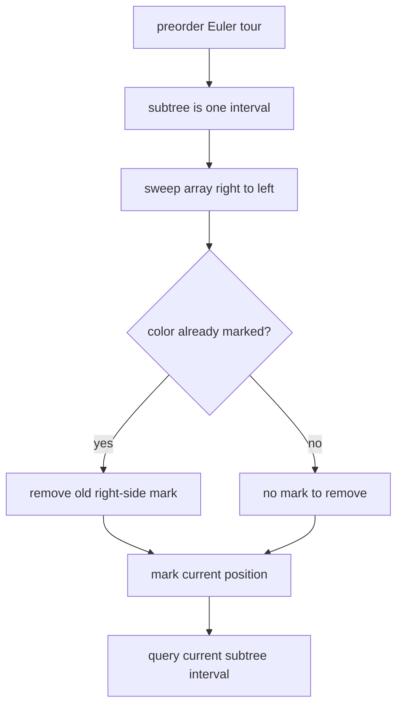

# Distinct Colors

- Source: CSES
- USACO Guide ID: `cses-1139`
- Difficulty at selection: Easy (checked in [Guide source commit 74a8cf6](https://github.com/cpinitiative/usaco-guide/blob/74a8cf603185c1cb84020b7a483a0e1bacef186e/content/4_Gold/Tree_Euler.problems.json))
- Original problem: [CSES Distinct Colors](https://cses.fi/problemset/task/1139)
- Tags: Euler Tour, Fenwick Tree, Offline Queries, Distinct Values
- Solution: [C++](../../solutions/cses-1139.cpp)

## Problem Summary

A tree is rooted at vertex 1 and each vertex has a color. For every vertex, count how many different color values appear among that vertex and all of its descendants.

This is a paraphrased study summary. Refer to the official page for the complete statement and constraints.

## Visualization Description

First flatten the rooted tree into preorder, with a colored tile for every vertex. Put a bracket under the contiguous tile interval belonging to each subtree. Then sweep a cursor from right to left. Within the current suffix, place a bright marker only on the leftmost tile of each color. When the cursor reaches a subtree's left endpoint, the number of markers inside its bracket is its distinct-color answer.

## Approach

Use an iterative enter/exit DFS to compute an Euler preorder and the half-open subtree interval `[entry[v], exit[v])` for every vertex.

Next scan Euler positions from right to left. Maintain one Fenwick-tree marker for each color: the leftmost occurrence of that color in the suffix processed so far. When a color is seen again, remove its older marker to the right, place a new marker at the current index, and update its remembered position. When the scan reaches `entry[v]`, query the marker sum across `v`'s subtree interval. Each color inside that interval contributes exactly one marker.

An `unordered_map` stores the latest position for color values as large as one billion. The DFS is iterative to handle maximum-depth trees safely.

## Correctness

Euler preorder makes every rooted subtree one contiguous interval. Consider the moment the right-to-left sweep reaches `entry[v]`. For each color occurring in the suffix, the algorithm keeps exactly its leftmost suffix occurrence marked: adding a new occurrence removes the previous representative before installing the new one.

If a color occurs in `v`'s subtree interval, its leftmost occurrence at or after `entry[v]` must also lie inside that interval, so it contributes one marker to the range sum. If a color does not occur in the subtree, it contributes no marker there. No color can contribute twice because only one occurrence is marked. Therefore the queried sum equals the number of distinct subtree colors for every vertex.

## Complexity

- Euler tour: `O(N)` time
- Sweep: `O(N log N)` expected time
- Space: `O(N)`

## Verification

The smoke test uses the official sample. The independent verifier generates small random trees and colors, explicitly visits every subtree, builds a Python set, and compares its size with the C++ answer. A 200,000-vertex path with all unique colors checks the iterative traversal and yields the predictable answers `N, N-1, ..., 1`.
