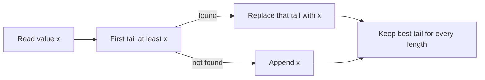

# Increasing Subsequence

- Source: CSES
- USACO Guide ID: `cses-1145`
- Difficulty at selection: Easy (checked in [Guide source commit ecd27b6](https://github.com/cpinitiative/usaco-guide/blob/ecd27b6eff69112891eabf0c968d3ad0b2a7f745/content/4_Gold/LIS.problems.json))
- Original problem: [CSES — Increasing Subsequence](https://cses.fi/problemset/task/1145)
- Tags: Longest Increasing Subsequence, Binary Search
- Solution: [C++](../../solutions/cses-1145.cpp)

## Problem Summary

Given an array, keep some elements in their original order so that every kept value is strictly larger than the one before it. Determine the maximum possible number of kept elements.

This summary is paraphrased for study. Refer to the official problem for the full statement and constraints.

## Visualization Description

Maintain one card for each achievable subsequence length. Card `k` shows the smallest ending value found for a length-`k` increasing subsequence. For each new number, binary-search the first card whose value is at least the number and replace it. If there is no such card, append a new one and grow the answer.

## Approach

Let `tails[k]` be the smallest possible last value of a strictly increasing subsequence of length `k+1` in the processed prefix. The array of tails is sorted. For each input value `x`, use `lower_bound` to find the first tail at least `x`. Replace that tail with `x`, or append `x` if every tail is smaller. The final number of tails is the LIS length.

## Correctness

Replacing the first tail at least `x` preserves the represented subsequence length and can only make that length easier to extend later. Every earlier tail is strictly smaller than `x`, so `x` can extend a subsequence to the replacement position's length. No later length can end at `x`, because its preceding required length already has a tail at least `x`. Thus after every prefix, `tails` stores the minimum ending value for each achievable length. A new entry is appended exactly when a longer increasing subsequence exists, so its final size is the LIS length.

## Complexity

- Time: `O(N log N)`
- Space: `O(N)`

## Verification

The official sample is smoke-tested. An independent oracle enumerates every subsequence of short random arrays. Cases include all equal values, strictly rising and falling arrays, duplicates near the optimum, and the maximum input size.
