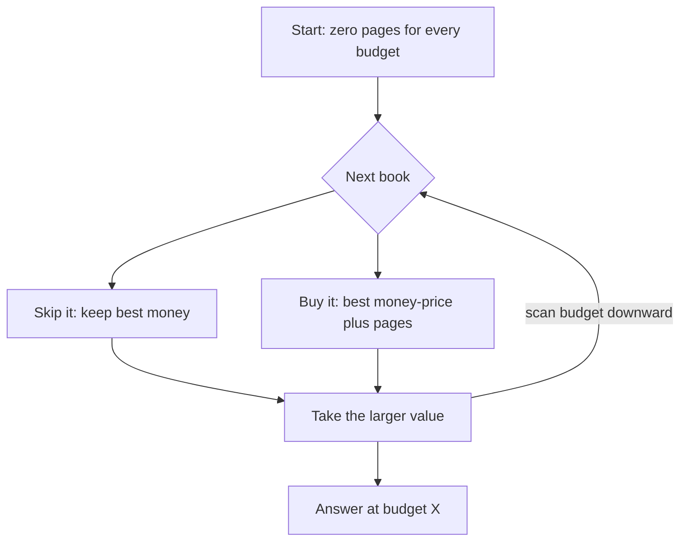

# Book Shop

- Source: CSES
- USACO Guide ID: `cses-1158`
- Difficulty at selection: Easy
- Original problem: [CSES — Book Shop](https://cses.fi/problemset/task/1158)
- Tags: Dynamic Programming, 0/1 Knapsack
- Solution: [`../../solutions/cses-1158.cpp`](../../solutions/cses-1158.cpp)

## Problem Summary

Each available book has a price and a page count. Choose any set of distinct books whose total price stays within a budget, maximizing the total pages. Each book can be bought at most once.

This summary is paraphrased for study. Use the official link for the full statement and constraints.

## Visualization Description

Imagine budget slots `0` through `X`. For each book, an arrow goes from capacity `money-price` to `money` and adds the book's pages. We sweep right to left, keeping the arrow's starting slot frozen in the previous-book state. A left-to-right sweep would let the same book feed its own newly updated states.

## Approach

Let `best[money]` be the maximum pages obtainable with processed books while spending at most `money`. Initialize all entries to zero. For each book, scan `money` downward from the full budget to its price and compare skipping the book with buying it after an optimal selection fitting in `money-price`.

## Correctness

Induct on the processed books. Before any book, buying nothing gives the correct value zero at every capacity. For a new book, every valid selection either excludes it, represented by the unchanged state, or includes it exactly once, leaving a selection of earlier books within the remaining capacity. The transition takes the better of these exhaustive cases. Descending capacity prevents the current book from appearing in the remaining-capacity state, so no selection buys it twice. After all books, `best[X]` is the maximum possible page count.

## Complexity

- Time: `O(NX)`
- Space: `O(X)`

## Verification

The smoke test uses the official sample. The independent verifier enumerates all subsets for small random collections, filters those within the budget, and compares the best page count. Extra cases cover an unaffordable book, equal prices, unused budget, and an optimum containing several books.
