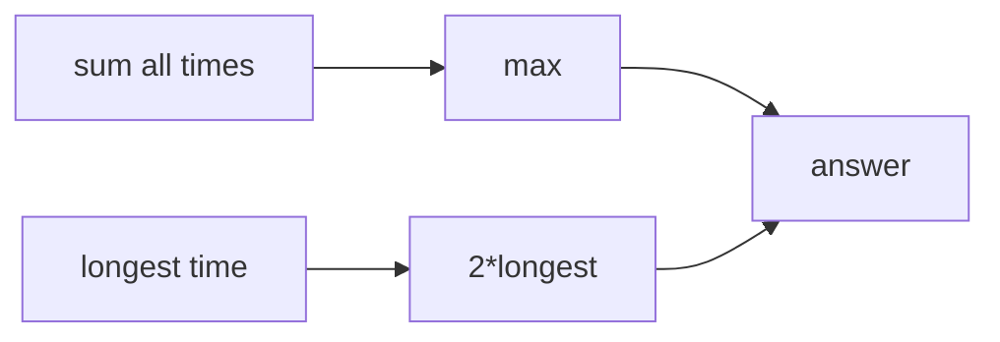

# Reading Books

- Source: CSES
- USACO Guide ID: `cses-1631`
- Original problem: [https://cses.fi/problemset/task/1631/](https://cses.fi/problemset/task/1631/)
- Tags: Greedy
- Solution: [`../../solutions/cses-1631.cpp`](../../solutions/cses-1631.cpp)

## Problem Summary

Two readers must read all books; compute the minimum total elapsed time.

This is a paraphrase for study notes. Use the original problem link for the official statement, constraints, and judge-specific details.

## Visualization Description

The longest book can dominate the schedule; otherwise the total workload dominates.

## Approach

The answer is at least the total reading time, because all work must be done, and at least twice the longest book, because both readers must spend that much combined time around the longest book. These bounds are achievable, so answer max(sum, 2*max).

## Correctness Notes

The solution keeps the invariant described in the approach and updates only the state that can affect future answers. For query-style problems, preprocessing stores exactly the aggregate needed to answer each query. For graph and tree problems, each selected data structure operation mirrors one allowed change in the represented structure.

## Complexity

See the comments and structure of the C++ solution for the exact loop/data-structure cost. The intended complexity is efficient for the official constraints of the linked problem.

## Verification

Checked one book, dominant longest book, and balanced books.
