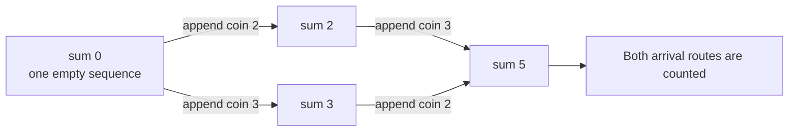

# Coin Combinations I

- Source: CSES
- USACO Guide ID: `cses-1635`
- Difficulty at selection: Easy
- Original problem: [CSES — Coin Combinations I](https://cses.fi/problemset/task/1635)
- Tags: Dynamic Programming, Knapsack, Counting
- Solution: [`../../solutions/cses-1635.cpp`](../../solutions/cses-1635.cpp)

## Problem Summary

Given several positive coin denominations and a target value, count the sequences of reusable coins whose values add to the target. Two sequences are different when their coin order differs. Return the count modulo `1,000,000,007`.

This summary is paraphrased for study. Use the official link for the full statement and constraints.

## Visualization Description

Draw one node for every sum from `0` through the target. From sum `s`, draw a directed edge labeled `c` to `s + c` for each denomination that stays within the target. A route from `0` to the target records coins in the exact order traversed, so routes `2 -> 3` and `3 -> 2` remain different.

## Approach

Let `ways[s]` be the number of ordered coin sequences with total `s`. There is one empty sequence for sum zero. For each sum from `1` to the target, try every coin as the sequence's final coin. If coin `c` fits, removing it leaves any valid sequence totaling `s-c`, so add `ways[s-c]`.

The sum loop must be outside the coin loop. That order finishes every smaller total before it is needed and lets distinct final-coin choices preserve different sequence orders.

## Correctness

Use induction on `s`. The base `ways[0] = 1` counts exactly the empty sequence. Assume all smaller totals are counted correctly. Every sequence totaling `s` has one unique final coin `c`; deleting that coin gives a sequence totaling `s-c`, and the transition from that state counts the original sequence. Conversely, appending `c` to any sequence counted by `ways[s-c]` creates a valid sequence totaling `s`. Different final coins form disjoint groups, so summing all transitions counts every valid ordered sequence exactly once. Thus `ways[target]` is the required answer.

## Complexity

- Time: `O(NX)`, where `N` is the number of denominations and `X` is the target
- Space: `O(X)`

## Verification

The smoke test uses the official sample. The independent verifier recursively enumerates every short ordered sequence for many small random coin sets and compares its exact count with the compiled solution. Deterministic cases cover an unreachable target, one denomination, and cases in which several orders create the same sum.
