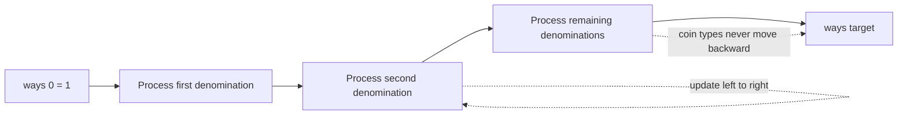

# Coin Combinations II

- Source: CSES
- USACO Guide ID: `cses-1636`
- Difficulty at selection: Easy
- Original problem: [CSES — Coin Combinations II](https://cses.fi/problemset/task/1636)
- Tags: Dynamic Programming, Knapsack, Counting
- Solution: [`../../solutions/cses-1636.cpp`](../../solutions/cses-1636.cpp)

## Problem Summary

Given distinct positive coin denominations and a target, count the reusable-coin combinations that add to the target. A combination is determined only by how many copies of each denomination it uses, so rearranging the same coins does not create a new answer. Return the count modulo `1,000,000,007`.

This summary is paraphrased for study. Use the official link for the full statement and constraints.

## Visualization Description

Imagine a table whose rows reveal denominations one at a time and whose columns are attainable sums. When processing coin `c`, each cell can receive combinations from `c` columns to its left in the same row. Moving left to right permits repeated copies of `c`; never returning to an earlier row gives every multiset one canonical construction order.

## Approach

Let `ways[s]` count combinations totaling `s` that use only denominations processed so far. Initialize `ways[0] = 1`. For each coin `c`, scan sums upward from `c` to the target and add `ways[s-c]` into `ways[s]`. The upward scan allows unlimited copies of the current coin. Keeping the coin loop outside ensures that a combination is generated only in nondecreasing denomination-processing order.

## Correctness

Induct over processed coin types. Before any denomination, the empty combination is the only achievable total, matching the initialization. Suppose the state is correct before coin `c`. During the upward scan, `ways[s]` keeps all combinations using zero copies of `c` and gains every combination made by appending one `c` to a combination for `s-c`; because that earlier cell has already been updated in this same scan, it may contain any number of copies of `c`. Every resulting combination has one unique count of `c`, so none is duplicated. Therefore the row is correct after processing `c`. After all denominations, `ways[target]` counts every unordered combination exactly once.

## Complexity

- Time: `O(NX)`
- Space: `O(X)`

## Verification

The smoke test uses the official sample. An independent oracle enumerates every possible count assigned to each denomination for small random inputs, sums those counts directly, and compares the total with the executable. Extra cases check an unreachable target, repeated use of one coin, and the difference from Coin Combinations I.
