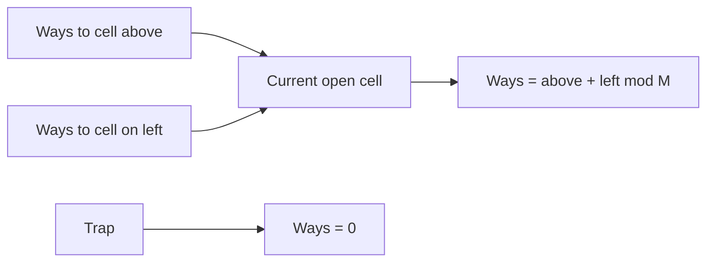

# Grid Paths I

- Source: CSES
- USACO Guide ID: `cses-1638`
- Difficulty at selection: Easy (checked in [Guide source commit ecd27b6](https://github.com/cpinitiative/usaco-guide/blob/ecd27b6eff69112891eabf0c968d3ad0b2a7f745/content/4_Gold/Paths_Grids.problems.json))
- Original problem: [Grid Paths I](https://cses.fi/problemset/task/1638)
- Tags: Dynamic Programming, Grids
- Solution: [C++](../../solutions/cses-1638.cpp)

## Problem Summary

Count the routes from the top-left to the bottom-right of a square grid when a route may move only right or down and may not enter a trapped cell. Return the count modulo 1,000,000,007.

This summary is paraphrased for study. Refer to the official problem for the complete statement and constraints.

## Visualization Description

Draw the grid with arrows entering each open square from its upper and left neighbors. Put a large X on every trap and write zero inside it. Sweep row by row; the number written in an open square is the sum of its two incoming neighbors. A single highlighted strip below the grid shows how the same one-dimensional array changes from “above” to “current row” as the sweep moves right.

## Approach

Process cells from top to bottom and left to right. For an open cell, add the path counts from above and from the left. For a trap, store zero. A one-dimensional array is sufficient: before updating `dp[column]`, it is the count from above; after updating, `dp[column - 1]` is the count from the current row's left neighbor. Seed the start with one route if it is open.

## Correctness

Every legal route into an open non-start cell makes its final move either down from the cell above or right from the cell to the left. These two groups are disjoint, so their counts add. A trap has no legal routes. The processing order ensures both predecessor counts are already correct when a cell is computed. Starting from the one empty route at the top-left, induction over row-major order proves every stored value equals the number of legal routes to that cell; therefore the final entry is the requested count.

## Complexity

The algorithm visits each of the `n²` cells once, so time is O(n²). The rolling array uses O(n) memory.

## Verification

The official sample is smoke-tested. An independent exhaustive oracle enumerates all right/down move strings for small grids, including blocked starts and finishes, single cells, narrow corridors, no-path layouts, random traps, and a 1000×1000 maximum-size grid.
