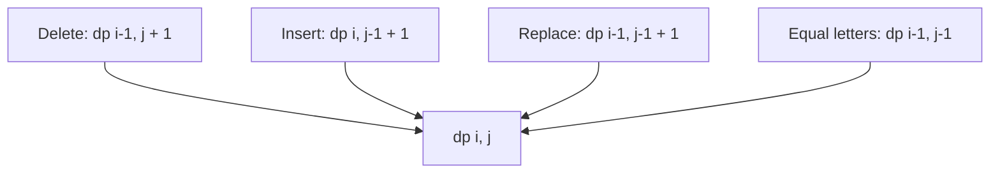

# Edit Distance

- Source: CSES
- USACO Guide ID: `cses-1639`
- Difficulty at selection: Easy (checked in [Guide source commit ecd27b6](https://github.com/cpinitiative/usaco-guide/blob/ecd27b6eff69112891eabf0c968d3ad0b2a7f745/content/4_Gold/Paths_Grids.problems.json))
- Original problem: [Edit Distance](https://cses.fi/problemset/task/1639)
- Tags: Dynamic Programming, Strings
- Solution: [C++](../../solutions/cses-1639.cpp)

## Problem Summary

Find the fewest single-character insertions, deletions, or replacements needed to turn one uppercase string into another.

This summary is paraphrased for study. Refer to the official problem for the complete statement and constraints.

## Visualization Description

Place prefixes of the first string down the rows and prefixes of the second across the columns. A horizontal step is an insertion, a vertical step is a deletion, and a diagonal step is a match or replacement. Every cell keeps the cheapest cost of reaching it, making the answer a shortest path from the empty-prefix corner to the full-string corner.

## Approach

Let `dp[i][j]` be the minimum edits between prefixes of lengths `i` and `j`. Empty-prefix cases cost the other prefix's length. If the newest letters match, inherit the diagonal value. Otherwise take one plus the minimum of deleting, inserting, or replacing. Because a row depends only on the prior row and its own left neighbor, store two rows and use the shorter string as the column dimension.

## Correctness

When the last letters match, an optimal transformation can leave them unchanged and solve the shorter prefixes. When they differ, the final edit must be a deletion, insertion, or replacement; removing that final operation produces exactly the corresponding predecessor subproblem. Taking the cheapest predecessor plus one therefore gives an attainable transformation and cannot exceed the optimum, while every possible optimum belongs to one of those cases and cannot be cheaper. With correct empty-prefix bases, induction over the table proves the final cell is the minimum edit count.

## Complexity

For lengths `n` and `m`, time is O(nm). Memory is O(min(n,m)) because only two rows are stored.

## Verification

The official sample is smoke-tested. An independent breadth-first search over short strings supplies exact answers without using the recurrence. Tests cover equal strings, one-letter differences, insert-only and delete-only directions, repeated letters, symmetry, random short strings, and length-5000 boundaries.
