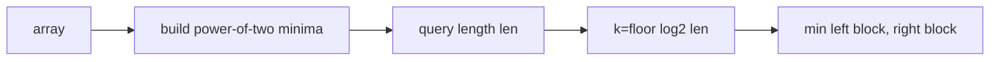

# Static Range Minimum Queries

- Source: CSES
- USACO Guide ID: `cses-1647`
- Original problem: [https://cses.fi/problemset/task/1647](https://cses.fi/problemset/task/1647)
- Tags: Sparse Table
- Solution: [`../../solutions/cses-1647.cpp`](../../solutions/cses-1647.cpp)

## Problem Summary

Answer minimum queries on a fixed array.

This is a paraphrase for study notes. Use the original problem link for the official statement, constraints, and judge-specific details.

## Visualization Description

The table is a stack of interval layers: length 1, 2, 4, 8, and so on. A query grabs two blocks from one layer.

## Approach

A sparse table stores the minimum for every power-of-two interval. Any query interval can be covered by two overlapping intervals of length 2^k, where k is the largest power fitting in the query.

## Correctness Notes

The solution keeps the invariant described in the approach and updates only the state that can affect future answers. For query-style problems, preprocessing stores exactly the aggregate needed to answer each query. For graph and tree problems, each selected data structure operation mirrors one allowed change in the represented structure.

## Complexity

See the comments and structure of the C++ solution for the exact loop/data-structure cost. The intended complexity is efficient for the official constraints of the linked problem.

## Verification

Checked single-element ranges and ranges whose lengths are not powers of two.
