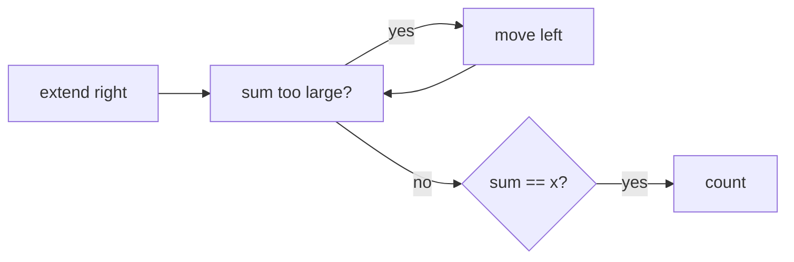

# Subarray Sums I

- Source: CSES
- USACO Guide ID: `cses-1660`
- Original problem: [https://cses.fi/problemset/task/1660](https://cses.fi/problemset/task/1660)
- Tags: Two Pointers
- Solution: [`../../solutions/cses-1660.cpp`](../../solutions/cses-1660.cpp)

## Problem Summary

Count subarrays with sum exactly x when all values are positive.

This is a paraphrase for study notes. Use the original problem link for the official statement, constraints, and judge-specific details.

## Visualization Description

A flexible window slides over the array, stretching to include new values and shrinking when it becomes too heavy.

## Approach

Positive values make the window sum monotonic as the right end moves. Expand right, then shrink left while the sum is too large. Each pointer only moves forward, giving linear time.

## Correctness Notes

The solution keeps the invariant described in the approach and updates only the state that can affect future answers. For query-style problems, preprocessing stores exactly the aggregate needed to answer each query. For graph and tree problems, each selected data structure operation mirrors one allowed change in the represented structure.

## Complexity

See the comments and structure of the C++ solution for the exact loop/data-structure cost. The intended complexity is efficient for the official constraints of the linked problem.

## Verification

Checked x met by single items, full array, and multiple windows.
